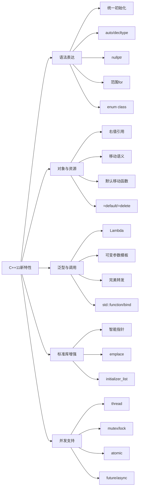

# C++11新特性总览

## 一句话理解

C++11 是现代 C++ 的分水岭：它把类型推导、移动语义、Lambda、智能指针和并发库带入标准，让 C++ 从“手动管理资源”为主转向更安全、更表达式化的写法。

## 知识点地图

## 核心分类

| 分类 | 代表特性 | 解决的问题 |
|------|----------|------------|
| 语法表达 | 统一初始化、`auto`、`decltype`、`nullptr`、范围 `for` | 减少样板代码，让类型和遍历表达更清晰 |
| 对象与资源 | 右值引用、移动语义、默认移动函数、`=default`、`=delete` | 降低拷贝成本，明确资源所有权和类行为 |
| 泛型与调用 | Lambda、可变参数模板、完美转发、`std::function`、`std::bind` | 提升泛型编程和回调表达能力 |
| 标准库增强 | 智能指针、`initializer_list`、`emplace` | 让资源管理和容器构造更安全高效 |
| 并发支持 | `thread`、`mutex`、`lock_guard`、`atomic`、`condition_variable`、`future` | 把线程、同步、异步纳入标准库 |

## 重点特性

### 语法表达

- **统一初始化**：用 `{}` 统一初始化对象、数组和容器，并支持 `std::initializer_list`。
- **auto**：根据初始化表达式推导变量类型，适合迭代器、Lambda 等复杂类型。
- **decltype**：获取表达式的精确类型和值类别，常用于泛型返回值推导；`decltype(auto)` 可原样保留引用返回。
- **nullptr**：类型为 `std::nullptr_t` 的空指针，避免 `NULL`/`0` 的重载二义性。
- **范围 for**：简化容器和数组遍历，修改元素时需要使用引用；循环中修改容器仍要遵守迭代器失效规则。
- **enum class**：强类型、带作用域的枚举，避免枚举值污染命名空间和隐式整数转换。

### 对象与资源

- **右值引用**：用 `&&` 区分可被移动的临时对象，为移动语义和完美转发打基础。
- **移动语义**：移动构造/移动赋值通过转移资源所有权减少深拷贝。
- **noexcept**：移动操作确实不抛异常时应标记；容器扩容时可据此放心选择移动而非拷贝。
- **默认移动函数**：C++11 新增默认移动构造和默认移动赋值，是否生成受析构、拷贝构造、拷贝赋值影响。
- **`=default` / `=delete`**：显式要求编译器生成默认实现，或禁止某个函数/重载被调用；常用 `= delete` 禁止拷贝。
- **类成员默认值**：允许在类内直接给成员设置默认初值。

### 泛型与调用

- **Lambda**：匿名函数对象，捕获变量成为成员；`[=]` 值捕获、`[&]` 引用捕获、`[this]` 捕获 this 指针。
- **可变参数模板**：用 `typename... Args` 表示任意数量和类型的模板参数。
- **完美转发**：通过万能引用和 `std::forward` 保留参数的左右值属性。
- **std::function**：类型擦除的通用可调用对象包装器；赋值会替换当前保存的普通函数、仿函数或 Lambda。
- **std::bind**：预绑定函数参数生成新的可调用对象；现代代码中常可用 Lambda 替代。

### 标准库与并发

- **智能指针**：`unique_ptr`、`shared_ptr`、`weak_ptr` 用 RAII 管理动态资源。
- **emplace**：在容器内部直接构造元素，减少临时对象。
- **线程库**：`std::thread` 管理线程，`mutex`/`lock_guard` 管理互斥，`atomic` 提供原子操作，`future`/`async` 支持异步结果。

## 底层理解

| 特性              | 底层理解                 |
| --------------- | -------------------- |
| `auto/decltype` | 都是编译期类型推导；auto 通常去顶层 const/引用，decltype 保留表达式类型和值类别 |
| 右值引用            | 本质仍是引用；具名右值引用变量本身是左值 |
| 移动语义            | 转移资源指针，源对象保持有效但状态未指定 |
| Lambda          | 编译器生成匿名函数对象，捕获变量成为成员，调用逻辑为 `operator()` |
| 可变参数模板          | 编译期展开，为不同参数组合生成实例    |
| `std::function` | 类型擦除，统一保存不同可调用对象     |

## 常见应用场景

- `auto`：处理 STL 迭代器、Lambda 等复杂类型声明。
- 移动语义：大型对象传参、返回值优化、容器插入。
- Lambda：STL 算法回调、事件处理、临时逻辑封装。
- 智能指针：管理动态对象生命周期，减少裸指针泄漏。
- 线程库：多线程任务、并发服务器、异步计算。
- `function` / `bind`：回调注册、延迟调用、统一可调用对象。

## 容易踩坑的地方

1. `auto` 会丢弃顶层 `const` 和引用，需要时写 `auto&` 或 `const auto&`。
2. 具名右值引用变量本身是左值，转移资源时仍需 `std::move`。
3. `std::move` 只做类型转换，不负责移动资源；真正移动发生在移动构造/移动赋值中。
4. Lambda 表达式各有独立闭包类型，不能随意互相赋值。
5. `std::thread` 析构前必须 `join` 或 `detach`，否则程序会终止。
6. 范围 `for` 修改元素时要写引用：`for (auto& e : vec)`。
7. `emplace` 传的是构造参数，不是已经构造好的对象。
8. `std::forward<T>(x)` 只在转发引用模板中按调用方值类别转发；不要用 `std::move` 把左值调用方意外移动走。
9. 值捕获在 Lambda 中默认不可修改，需加 `mutable`；引用捕获或捕获 `this` 时，要保证外部对象生命周期覆盖 Lambda 使用期。

## 面试高频问题

1. C++11 主要引入了哪些语言特性和库特性？
2. 左值和右值的区别是什么？右值引用解决了什么问题？
3. 移动语义和拷贝语义的区别是什么？什么时候会触发移动构造？
4. `std::move` 和 `std::forward` 的区别是什么？
5. Lambda 的底层实现是什么？捕获列表有哪些方式？
6. 可变参数模板如何展开参数包？
7. `std::function` 的类型擦除是什么意思？
8. C++11 新增了哪些默认成员函数？
9. `std::thread` 的生命周期管理要注意什么？
10. `auto`、`decltype`、`decltype(auto)` 的区别是什么？
11. `nullptr`、`enum class`、`=default`、`=delete` 分别解决什么问题？

## 我的薄弱点

- 曾误以为 `decltype` 依赖 RTTI；应记住它与 `auto` 一样完全在编译期推导。
- 需要巩固转发引用的条件：只有函数模板中由调用推导的 `T&&` 才能同时接收并转发左值、右值。
- 需记住 `std::thread` 析构不会自动等待，仍处于 joinable 状态会 `std::terminate()`。

## 成长记录

- 2026-07-17：能区分左值/右值、`std::move` 的类型转换本质、移动构造的资源转移，以及 `noexcept` 对 vector 扩容的影响。
- 2026-07-17：掌握 Lambda 闭包模型、捕获方式、`std::function` 的类型擦除与运行时替换语义。

## 关联知识

- [[智能指针]]
- [[模板]]
- [[C++设计模式]]
- [[不定参数解析]]
- [[内存管理]]
