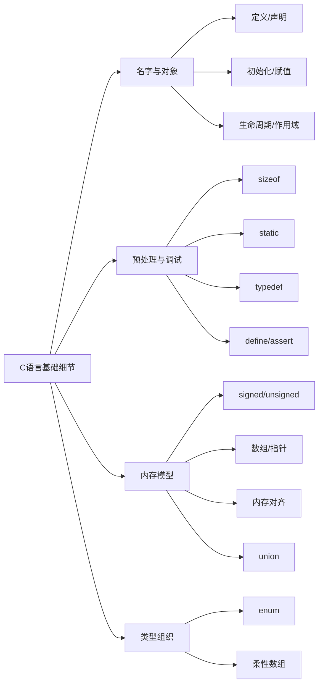

# C语言基础细节

## 一句话理解

C 语言基础细节速查，重点区分定义/声明、`sizeof`、`static`、宏、数组与指针、对齐、联合体和柔性数组。

## 知识点地图

## 核心概念

| 概念   | 要点                 |
| ---- | ------------------ |
| 定义   | 创建对象或函数实体，通常分配存储空间 |
| 声明   | 告诉编译器名称和类型，不一定分配空间 |
| 初始化  | 对象创建时赋初值，只发生一次     |
| 赋值   | 对已存在对象写入新值，可发生多次   |
| 生命周期 | 对象从创建到销毁的时间范围      |
| 作用域  | 名字在代码中可见的范围        |

## 常见细节

| 主题               | 结论                                              |
| ---------------- | ----------------------------------------------- |
| `sizeof`         | 运算符，不是函数；类型必须写成 `sizeof(type)`，表达式可写 `sizeof x` |
| signed/unsigned  | 存储都是二进制位，区别在解释方式；混用时注意隐式转换                      |
| `static` 全局变量/函数 | 限制在当前源文件可见                                      |
| `static` 局部变量    | 生命周期到程序结束，只初始化一次                                |
| `typedef`        | 类型别名，不是文本替换；如需无符号别名应单独定义 `uint32`               |
| `#define`        | 预处理文本替换，无类型检查；参数要加括号，避免副作用                      |
| 数组               | 连续对象集合，`sizeof(arr)` 是数组总字节数                    |
| 指针               | 保存地址的变量，`sizeof(p)` 是指针大小，通常 4/8 字节             |
| 数组传参             | 会退化为指针，长度信息丢失                                   |
| 内存对齐             | 结构体成员可能插入填充字节，换取更高访问效率                          |
| `union`          | 所有成员共享同一块内存，大小由最大成员和对齐决定                        |
| `enum`           | 一组命名整数常量，底层大小由编译器决定                             |
| 柔性数组             | C99 特性，只能作为结构体最后一个成员，适合变长数据                     |
| `assert`         | 运行期检查不变量；是否启用由 `NDEBUG` 在预处理阶段决定，不能替代错误处理       |

## 常见应用场景

- `static`：文件内私有函数、局部静态缓存。
- `union`：协议解析、节省存储、大小端判断。
- `enum`：状态码、错误码、选项集合。
- 内存对齐：协议头、硬件寄存器、二进制文件格式。
- 柔性数组：消息缓冲区、变长结构体。
- 宏：日志、条件编译、简单代码生成。

## 容易踩坑的地方

1. `sizeof(arr)` 和 `sizeof(p)` 完全不同，数组传参后也会变成指针。
2. 宏只是替换文本，`MAX(++a, b)` 这类写法可能多次求值。
3. 有符号和无符号混用可能触发隐式转换。
4. `static` 局部变量只初始化一次，多次调用共享同一个对象。
5. 结构体对齐会引入填充字节，不能直接假设成员紧密排列。
6. `typedef` 产生的是完整类型名，`typedef int int32` 后不能写 `unsigned int32`，应单独定义无符号别名。
7. `assert` 条件在运行期判断，但可能被 `NDEBUG` 在预处理阶段关闭，不适合处理线上错误。

## 面试高频问题

1. `sizeof` 是函数吗？数组和指针的结果有什么区别？
2. `static` 修饰全局变量、局部变量、函数分别有什么效果？
3. 指针和数组有什么区别？函数传参时会发生什么？
4. 有符号和无符号整数混合运算有什么风险？
5. 宏和 `typedef` 的区别是什么？
6. 结构体内存对齐的作用和规则是什么？
7. `union` 的内存布局是什么？为什么能用于判断大小端？
8. 柔性数组的用途和限制是什么？
9. `assert` 是编译期检查还是运行期检查？`NDEBUG` 对它有什么影响？

## 关联知识

暂无强关联知识点。后续如果单独整理 C 的 `malloc/free`、`stdarg.h` 或预处理宏，再在这里补充链接。
