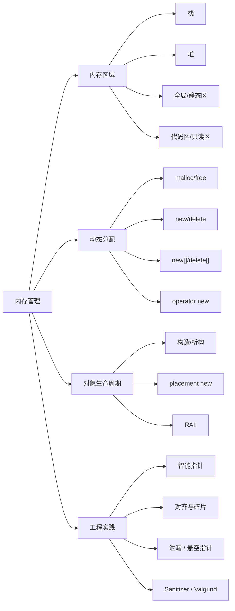

# 内存管理

## 一句话理解

C++ 内存管理的重点是：理解程序内存区域、掌握 `new/delete` 和 `malloc/free` 的区别，并用 RAII / 智能指针减少手动释放带来的风险。

## 知识点地图



## 程序内存区域

| 区域     | 存放内容                     | 生命周期/特点          |
| ------ | ------------------------ | ---------------- |
| 栈      | 局部变量、函数参数、返回地址           | 编译器自动管理，函数结束自动释放 |
| 堆      | `malloc` / `new` 动态申请的内存 | 程序员手动释放，容易泄漏     |
| 全局/静态区 | 全局变量、静态变量                | 程序启动时分配，结束时释放    |
| 只读数据区  | 字符串常量、只读全局常量             | 通常不可修改           |
| 代码区    | 程序机器指令                   | 只读、可执行           |
| 内存映射区  | 动态库、共享内存、文件映射            | 由操作系统参与管理        |

典型进程地址空间从低地址到高地址可粗略记为：

```text
低地址
代码段 .text
只读数据段 .rodata
数据段 .data / .bss
堆 heap            通常向高地址增长
内存映射区 mmap     动态库、共享内存、文件映射
栈 stack           通常向低地址增长
高地址
```

从高地址到低地址就是：栈、内存映射区、堆、数据段、只读数据段、代码段。这个顺序只适合作为常见模型，具体布局会受操作系统、平台位数、编译器、链接方式和 ASLR 影响。

面试常问：堆和栈的区别。核心答法是“管理方式、生命周期、分配效率、空间大小和使用场景不同”。

## 动态内存分配

### malloc/free

`malloc/free` 是 C 风格内存管理：

- `malloc(size)` 只申请原始字节，不调用构造函数。
- `free(ptr)` 只释放内存，不调用析构函数。
- 失败时返回 `NULL`。
- 返回 `void*`，C++ 中通常需要类型转换。

### new/delete

`new/delete` 是 C++ 对象级内存管理：

- `new` = 申请内存 + 调用构造函数。
- `delete` = 调用析构函数 + 释放内存。
- 申请失败默认抛出 `std::bad_alloc`。
- 返回具体类型指针，类型更安全。

```cpp
T* p = new T(args);  // 分配内存并构造对象
delete p;            // 析构对象并释放内存
```

## new/delete 的底层关系

| 表达式 | 底层步骤 |
|--------|----------|
| `new T` | 调用 `operator new` 分配内存，再调用 `T` 的构造函数 |
| `delete p` | 调用 `T` 的析构函数，再调用 `operator delete` 释放内存 |
| `new T[n]` | 分配数组空间，并构造 `n` 个对象 |
| `delete[] p` | 析构 `n` 个对象，并释放数组空间 |

注意：`new/delete` 是表达式，`operator new/operator delete` 是负责分配和释放原始内存的函数。

默认 `operator new` 常委托给运行时分配器，但 C++ 不要求它必须通过 `malloc` 实现；类也可以重载自己的 `operator new/delete`。

## new 和 malloc 的区别

| 对比 | `new/delete` | `malloc/free` |
|------|--------------|---------------|
| 语言 | C++ | C |
| 申请单位 | 类型 | 字节数 |
| 返回类型 | 具体类型指针 | `void*` |
| 构造/析构 | 会调用 | 不会调用 |
| 失败处理 | 默认抛异常 | 返回 `NULL` |
| 能否重载 | `operator new/delete` 可重载 | 不可重载 |

一句话：`malloc/free` 管内存，`new/delete` 管对象生命周期。

## placement new

placement new 用于在一块已经分配好的原始内存上构造对象，常见于内存池、对象池。

```cpp
void* buf = operator new(sizeof(T));
T* p = new(buf) T(args);  // 在 buf 上构造对象
p->~T();                  // 手动析构
operator delete(buf);     // 释放原始内存
```

重点：placement new 只负责构造对象，不负责申请内存；对象析构也需要手动调用析构函数。

已有内存必须满足 `T` 的大小和对齐要求。placement new 构造出的对象不能直接 `delete`，应先手动析构，再按原始内存的分配方式释放。

## 内存对齐与结构体大小

对齐要求的是对象或成员的起始地址满足相应倍数。编译器会在成员间加入填充，并在结构体末尾加入尾部填充。

尾部填充使 `sizeof(T)` 成为 `alignof(T)` 的整数倍，这样 `T arr[n]` 中每个元素的起始地址都仍满足对齐。一般把对齐要求大的成员放前面，可减少填充：

```cpp
struct A { char c; double d; int i; };  // 常见 24 字节
struct B { double d; int i; char c; };  // 常见 16 字节
```

具体大小取决于平台和 ABI；不对齐的访问可能更慢，某些架构上甚至会出错。

## 内存碎片与内存池

- **外部碎片**：空闲内存分散成小块，总量够却找不到足够大的连续块。
- **内部碎片**：分配块大于实际需求，块内多出的空间被浪费。

对象池/内存池会预分配大块内存，再按固定大小或分级大小切分复用。它能减少频繁分配、缓解外部碎片，并可能改善局部性；代价是实现和并发管理更复杂、固定块可能产生内部碎片、峰值内存也可能更高。

## RAII 和智能指针

手动 `new/delete` 容易在异常、分支返回、复杂所有权中出错。工程中更推荐：

- 栈对象优先：能不用堆就不用堆。
- RAII 管理资源：对象析构自动释放资源。
- 智能指针管理动态对象：详见 [[智能指针]]。

## 容易踩坑的地方

1. `new` 必须配 `delete`，`new[]` 必须配 `delete[]`，混用是未定义行为。
2. `malloc` 申请的内存不能用 `delete` 释放，`new` 出来的对象也不能用 `free` 释放。
3. `delete` 后当前指针仍保存旧地址，它是**悬空指针**；未初始化或已无意义的指针通常称野指针，悬空指针可视为其中一种。
4. 忘记释放堆内存会导致内存泄漏。
5. placement new 构造的对象需要手动调用析构函数。
6. `delete nullptr` 是安全的，但重复 `delete` 同一块内存是未定义行为。
7. `new` 失败默认抛异常，`malloc` 失败返回 `NULL`，错误处理方式不同。

## 排查工具

| 工具 | 适合发现的问题 |
| --- | --- |
| `gdb` | 崩溃调用栈、变量和内存现场，定位问题位置 |
| Valgrind Memcheck | 泄漏、非法读写、重复释放、未初始化内存；运行较慢 |
| ASan | 越界、use-after-free、double free，适合日常测试 |
| LSan / UBSan / TSan | 泄漏 / 未定义行为 / 数据竞争 |

Sanitizer 需要编译时开启，例如 ASan 常用 `-fsanitize=address`。工具用于定位，根治仍靠所有权清晰、RAII 和测试覆盖。

## 面试高频问题

1. 程序内存区域有哪些？堆和栈有什么区别？
2. `new/delete` 和 `malloc/free` 的区别是什么？
3. `new` 一个对象的底层过程是什么？`delete` 呢？
4. `operator new` 和 `new` 表达式有什么区别？
5. 为什么 `new[]` 要配 `delete[]`？
6. placement new 是什么？什么场景会用？
7. 什么是内存泄漏、野指针、悬空指针？如何避免？
8. RAII 如何解决手动内存管理的问题？
9. 内存泄漏如何排查？常见工具有哪些？
10. 什么是内存对齐？为什么成员顺序会影响 `sizeof`？
11. 外部碎片和内部碎片分别是什么？内存池的收益与代价？

## 我的薄弱点

- 曾混淆悬空指针与野指针：对象已释放但指针仍指向旧地址是悬空指针。
- 需要巩固结构体尾部填充的直接目的：保证数组中每个元素仍按要求对齐，而不只是“加快寻址”。

## 成长记录

- 2026-07-13：能区分 `new` 表达式与 `operator new`，并说明 placement new 的构造、析构和释放边界。
- 2026-07-13：能解释 `new[]/delete[]` 配对、内存碎片与对象池的基本取舍，并列出常用内存排查工具。

## 关联知识

- [[智能指针]]
- [[C++11新特性总览]]
