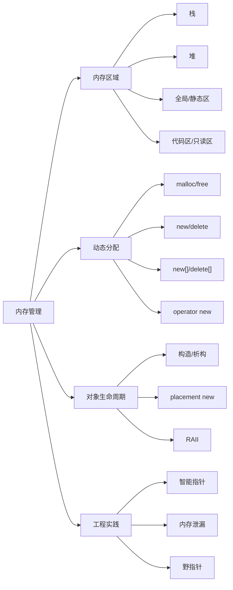

# 内存管理

## 一句话理解

C++ 内存管理的重点是：理解程序内存区域、掌握 `new/delete` 和 `malloc/free` 的区别，并用 RAII / 智能指针减少手动释放带来的风险。

## 知识点地图



## 程序内存区域

| 区域     | 存放内容                     | 生命周期/特点          |
| ------ | ------------------------ | ---------------- |
| 栈      | 局部变量、函数参数、返回地址           | 编译器自动管理，函数结束自动释放 |
| 堆      | `malloc` / `new` 动态申请的内存 | 程序员手动释放，容易泄漏     |
| 全局/静态区 | 全局变量、静态变量                | 程序启动时分配，结束时释放    |
| 只读数据区  | 字符串常量、只读全局常量             | 通常不可修改           |
| 代码区    | 程序机器指令                   | 只读、可执行           |
| 内存映射区  | 动态库、共享内存、文件映射            | 由操作系统参与管理        |

典型进程地址空间从低地址到高地址可粗略记为：

```text
低地址
代码段 .text
只读数据段 .rodata
数据段 .data / .bss
堆 heap            通常向高地址增长
内存映射区 mmap     动态库、共享内存、文件映射
栈 stack           通常向低地址增长
高地址
```

从高地址到低地址就是：栈、内存映射区、堆、数据段、只读数据段、代码段。这个顺序只适合作为常见模型，具体布局会受操作系统、平台位数、编译器、链接方式和 ASLR 影响。

面试常问：堆和栈的区别。核心答法是“管理方式、生命周期、分配效率、空间大小和使用场景不同”。

## 动态内存分配

### malloc/free

`malloc/free` 是 C 风格内存管理：

- `malloc(size)` 只申请原始字节，不调用构造函数。
- `free(ptr)` 只释放内存，不调用析构函数。
- 失败时返回 `NULL`。
- 返回 `void*`，C++ 中通常需要类型转换。

### new/delete

`new/delete` 是 C++ 对象级内存管理：

- `new` = 申请内存 + 调用构造函数。
- `delete` = 调用析构函数 + 释放内存。
- 申请失败默认抛出 `std::bad_alloc`。
- 返回具体类型指针，类型更安全。

```cpp
T* p = new T(args);  // 分配内存并构造对象
delete p;            // 析构对象并释放内存
```

## new/delete 的底层关系

| 表达式 | 底层步骤 |
|--------|----------|
| `new T` | 调用 `operator new` 分配内存，再调用 `T` 的构造函数 |
| `delete p` | 调用 `T` 的析构函数，再调用 `operator delete` 释放内存 |
| `new T[n]` | 分配数组空间，并构造 `n` 个对象 |
| `delete[] p` | 析构 `n` 个对象，并释放数组空间 |

注意：`new/delete` 是表达式，`operator new/operator delete` 是负责分配和释放原始内存的函数。

## new 和 malloc 的区别

| 对比 | `new/delete` | `malloc/free` |
|------|--------------|---------------|
| 语言 | C++ | C |
| 申请单位 | 类型 | 字节数 |
| 返回类型 | 具体类型指针 | `void*` |
| 构造/析构 | 会调用 | 不会调用 |
| 失败处理 | 默认抛异常 | 返回 `NULL` |
| 能否重载 | `operator new/delete` 可重载 | 不可重载 |

一句话：`malloc/free` 管内存，`new/delete` 管对象生命周期。

## placement new

placement new 用于在一块已经分配好的原始内存上构造对象，常见于内存池、对象池。

```cpp
void* buf = operator new(sizeof(T));
T* p = new(buf) T(args);  // 在 buf 上构造对象
p->~T();                  // 手动析构
operator delete(buf);     // 释放原始内存
```

重点：placement new 只负责构造对象，不负责申请内存；对象析构也需要手动调用析构函数。

## RAII 和智能指针

手动 `new/delete` 容易在异常、分支返回、复杂所有权中出错。工程中更推荐：

- 栈对象优先：能不用堆就不用堆。
- RAII 管理资源：对象析构自动释放资源。
- 智能指针管理动态对象：详见 [[智能指针]]。

## 容易踩坑的地方

1. `new` 必须配 `delete`，`new[]` 必须配 `delete[]`，混用是未定义行为。
2. `malloc` 申请的内存不能用 `delete` 释放，`new` 出来的对象也不能用 `free` 释放。
3. `delete` 后指针仍保存旧地址，继续使用就是野指针。
4. 忘记释放堆内存会导致内存泄漏。
5. placement new 构造的对象需要手动调用析构函数。
6. `delete nullptr` 是安全的，但重复 `delete` 同一块内存是未定义行为。
7. `new` 失败默认抛异常，`malloc` 失败返回 `NULL`，错误处理方式不同。

## 面试高频问题

1. 程序内存区域有哪些？堆和栈有什么区别？
2. `new/delete` 和 `malloc/free` 的区别是什么？
3. `new` 一个对象的底层过程是什么？`delete` 呢？
4. `operator new` 和 `new` 表达式有什么区别？
5. 为什么 `new[]` 要配 `delete[]`？
6. placement new 是什么？什么场景会用？
7. 什么是内存泄漏、野指针、悬空指针？如何避免？
8. RAII 如何解决手动内存管理的问题？
9. 内存泄漏如何排查？常见工具有哪些？

## 关联知识

- [[智能指针]]
- [[C++11新特性总览]]
