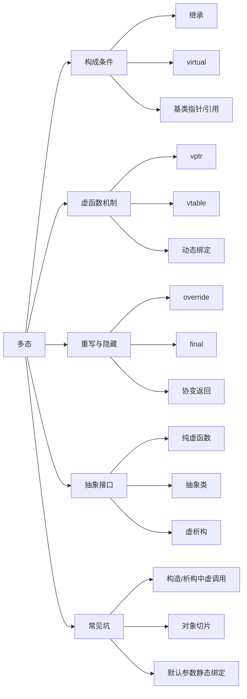

# 多态

## 一句话理解

多态是“同一接口，不同实现”。C++ 的运行时多态主要靠 **继承 + 虚函数 + 基类指针/引用** 实现，底层依赖虚函数表和虚表指针。

## 知识点地图



## 核心条件

运行时多态需要同时满足：

1. 有继承关系。
2. 基类中有虚函数。
3. 派生类重写该虚函数。
4. 通过基类指针或引用调用虚函数。

```cpp
class Person {
public:
    virtual void action() { cout << "Person\n"; }
};

class Student : public Person {
public:
    void action() override { cout << "Student\n"; }
};

Person* p = new Student;
p->action();  // Student
delete p;
```

如果不是通过基类指针/引用，而是发生对象拷贝，就会出现对象切片，多态失效。

## 虚函数机制

| 名词        | 作用                  |
| --------- | ------------------- |
| `virtual` | 标记函数支持动态绑定          |
| vtable    | 虚函数表，保存虚函数地址        |
| vptr      | 虚表指针，对象中指向对应类的虚表    |
| 动态绑定      | 运行时根据对象真实类型决定调用哪个函数 |

动态调用过程：

```text
基类指针/引用
  -> 对象中的 vptr
  -> 对应类的 vtable
  -> 目标虚函数地址
```

派生类虚表生成规则：

1. 继承基类虚表。
2. 重写的虚函数覆盖对应表项。
3. 新增虚函数追加到虚表中。

虚函数表由编译器生成，通常放在只读数据区；对象中保存的 vptr 位置和布局由编译器实现决定。

## 重写、隐藏、重载

| 概念  | 发生位置   | 条件            | 调用决定         |
| --- | ------ | ------------- | ------------ |
| 重载  | 同一作用域  | 函数名相同，参数不同    | 编译期按参数选择     |
| 重写  | 基类/派生类 | 基类虚函数，派生类签名匹配 | 运行期按对象真实类型选择 |
| 隐藏  | 基类/派生类 | 同名即可，参数可不同    | 编译期按静态类型选择   |

重写条件：

- 基类函数是虚函数。
- 函数名、参数列表、返回类型兼容。
- 返回类型允许协变：返回基类指针/引用时，派生类可返回派生类指针/引用。
- 建议派生类重写时加 `override`，让编译器帮忙检查。

`final` 可禁止继续重写。

## 抽象类和虚析构

纯虚函数写法：

```cpp
class Shape {
public:
    virtual void draw() = 0;
};
```

包含纯虚函数的类是抽象类，不能直接实例化。派生类必须实现所有纯虚函数，才能创建对象。

基类如果要通过基类指针删除派生类对象，析构函数必须是虚函数：

```cpp
class Base {
public:
    virtual ~Base() = default;
};
```

否则：

```cpp
Base* p = new Derived;
delete p;  // 基类析构非 virtual 时，派生类析构可能不被调用
```

这是面试高频点。

## 构造析构中的虚函数

构造函数和析构函数中可以调用虚函数，但不会表现出完整多态：

- 构造基类时，派生类部分还没构造好，只会调用当前构造层级的版本。
- 析构基类时，派生类部分已经析构完，也只会调用当前析构层级的版本。

所以不要依赖构造/析构函数里的虚函数调用实现多态行为。

## 容易踩坑的地方

1. 基类析构函数忘记写 `virtual`，通过基类指针删除派生类对象可能资源泄漏。
2. 重写函数签名写错，实际变成隐藏；用 `override` 可以避免。
3. 对象切片：把派生类对象按值赋给基类对象，派生类部分被切掉。
4. 构造/析构函数中调用虚函数，不会产生完整多态。
5. 虚函数默认参数是静态绑定，根据指针/引用的静态类型决定。
6. 构造函数不能是虚函数；析构函数可以是虚函数，且基类通常应该写成虚析构。
7. 静态成员函数不能是虚函数，因为它不依赖对象，也没有 `this` 指针。
8. 虚函数有间接调用成本，且通常不利于内联，但这不是设计时的首要顾虑。

## 面试高频问题

1. 多态的构成条件是什么？
2. 多态底层如何实现？vptr 和 vtable 分别是什么？
3. 派生类虚表如何生成？
4. 重载、重写、隐藏有什么区别？
5. 为什么基类析构函数通常要声明为虚函数？
6. 构造函数和析构函数中调用虚函数会发生什么？
7. 什么是对象切片？为什么会导致多态失效？
8. 虚函数默认参数为什么是静态绑定？
9. `override` 和 `final` 有什么作用？
10. 哪些函数不能是虚函数？为什么？

## 关联知识

- [[继承]]
- [[类和对象]]
- [[C++异常]]
