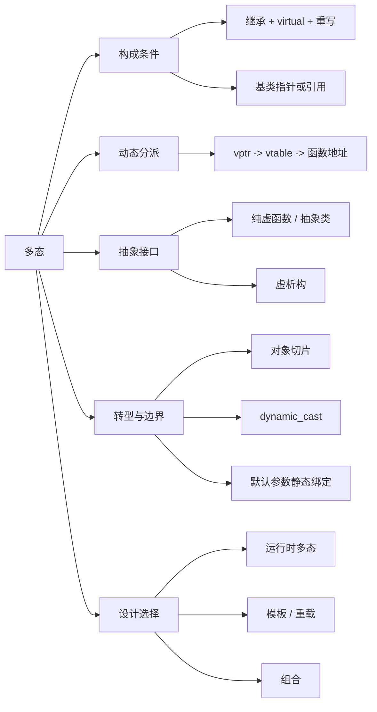

# 多态

## 一句话理解

多态是“同一接口，不同实现”。运行时多态适合运行时才确定实际策略的场景；类型和策略能在编译期确定时，模板通常更轻、更容易内联。

## 知识点地图



## 运行时多态的条件

1. 有继承关系。
2. 基类声明虚函数，派生类正确重写。
3. 通过基类指针或引用调用，实际绑定派生对象。

```cpp
class Base {
public:
    virtual void f() {}
    virtual ~Base() = default;
};

class Derived : public Base {
public:
    void f() override {}
};

Base* p = new Derived;
p->f();  // 调用 Derived::f
delete p;
```

`Base b = Derived{};` 会按值复制并发生对象切片，只保留 `Base` 部分，不能实现运行时多态。

## 动态分派与成本

常见实现中，多态对象含有指向虚表的 `vptr`；虚表保存对应虚函数的入口地址。调用时，编译期确定虚表槽位，运行期通过对象的 `vptr` 找到真实类型对应的函数地址。

```text
Base* / Base& -> 对象 vptr -> 虚表槽位 -> 实际覆盖函数
```

- 虚表、`vptr`、对象布局均属于 ABI 实现细节，不是 C++ 标准强制规则；多继承对象可能有多个 `vptr`。
- 成本主要是对象额外指针、间接调用和潜在的分支预测损失。
- 虚调用通常不利于内联；若编译器能确定真实类型（如 `final`、局部对象），可能去虚化并内联。

## 重载、隐藏与重写

| 概念 | 条件 | 调用决定 |
| --- | --- | --- |
| 重载 | 同一作用域，同名不同参数 | 编译期按参数选择 |
| 隐藏 | 派生类声明同名函数，参数可不同 | 按静态类型查找 |
| 重写 | 基类虚函数，派生类签名兼容 | 运行期按动态类型选择 |

重写的返回类型通常必须相同；例外是协变返回：基类返回 `Base*` 或 `Base&` 时，派生类可返回 `Derived*` 或 `Derived&`。

```cpp
class Base { public: virtual Base* clone() const; };
class Derived : public Base {
public:
    Derived* clone() const override;  // 协变返回
};
```

`override` 要求该函数必须成功重写基类虚函数，可防止参数或 `const` 写错而意外隐藏。`final` 可禁止继续重写某个虚函数，也可禁止类继续被继承。

## 抽象类与虚析构

```cpp
class Shape {
public:
    virtual void draw() = 0;  // 纯虚函数
    virtual ~Shape() = default;
};
```

含纯虚函数的类是抽象类，不能实例化；派生类若未实现全部纯虚函数，也仍是抽象类。纯虚函数可以有函数体；纯虚析构函数尤其必须在类外提供定义，因为析构链仍会调用它。

只要可能通过基类指针删除派生对象，基类析构函数就应为 `virtual`；否则 `delete Base*` 可能不执行派生类析构，属于未定义行为。

## 转型与常见边界

| 转换 | 在继承体系中的用途 | 安全性 |
| --- | --- | --- |
| `dynamic_cast` | 向下/横向转型，运行时检查 | 失败时指针为 `nullptr`，引用抛 `std::bad_cast` |
| `static_cast` | 常规转换、明确的向上转型；也可向下转型 | 向下转型不检查真实类型 |
| `reinterpret_cast` | 重新解释位模式或地址 | 语义保证极少，业务代码中慎用 |

`dynamic_cast` 进行向下或横向转型时，需要多态基类来提供 RTTI；普通向上转型天然安全，不需要它。

虚函数的实现是动态绑定，但默认参数是静态绑定：通过 `Base*` 调用派生类重写函数时，执行派生类实现、使用基类声明处的默认参数。因此不要在派生类中修改虚函数默认参数。

构造和析构期间，虚调用只分派到当前已构造完成、或尚未析构完成的层级；不要依赖它访问派生类状态。

## 设计选择

- 运行时多态：实际类型和策略到运行时才知道，如插件、设备、可替换业务策略。
- 模板/重载：类型在编译期确定，追求零抽象开销和内联时使用；模板可能增加代码体积和编译复杂度。
- 组合：只是“拥有某能力”时优先组合；确实是 is-a 并需要替换性时再用公有继承。

## 高频问题

1. 运行时多态需要哪些条件？
2. 虚函数如何动态分派？虚表和 `vptr` 是语言标准吗？
3. 重载、隐藏、重写的区别？`override` 与 `final` 的作用？
4. 什么是纯虚函数和抽象类？纯虚析构函数为什么还要有定义？
5. 为什么基类析构函数通常是虚函数？
6. `dynamic_cast`、`static_cast`、`reinterpret_cast` 如何选择？
7. 虚函数默认参数为何是静态绑定？
8. 虚函数的成本是什么，为什么仍可能被内联？
9. 虚函数多态、模板和组合如何选择？

## 我的薄弱点

- 虚表和 `vptr` 的调用链已经掌握，但曾将常见对象布局误当成标准规定；回答时应明确它是 ABI 实现。
- 需要巩固 RTTI 与 `dynamic_cast` 的边界：重点是向下/横向转型的运行时检查，向上转型不需要它。

## 成长记录

- 2026-07-11：能完整说出运行时多态的构成条件，并能区分运行时多态与模板/重载的适用场景。
- 2026-07-11：能正确解释虚函数调用路径、纯虚函数、协变返回、虚函数默认参数的静态绑定，以及 `override`/`final` 的意义。

## 关联知识

- [[继承]]
- [[类和对象]]
- [[模板]]
- [[C++11新特性总览]]
