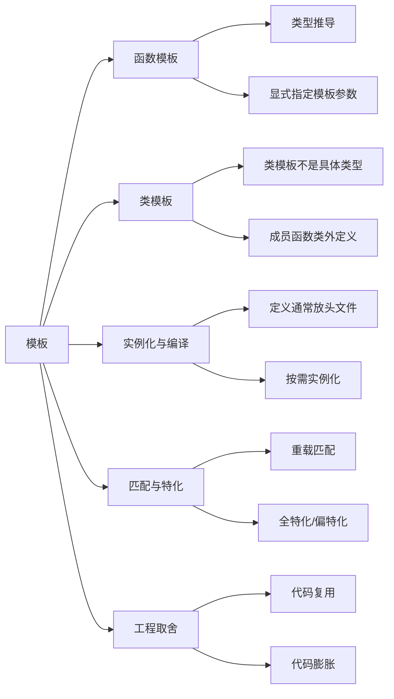

# 模板

## 一句话理解

模板是 C++ 的编译期代码生成机制：写一份与类型无关的代码，编译器按实际类型实例化出具体函数或类。

## 知识点地图



## 核心原理

| 主题     | 重点                                 |
| ------ | ---------------------------------- |
| 函数模板   | 生成一组同名函数，调用时可自动推导模板参数              |
| 类模板    | 生成一组类，必须实例化后才是具体类型，如 `vector<int>` |
| 编译期实例化 | 模板本身不是函数/类，使用时才生成具体代码              |
| 零运行时开销 | 类型推导和实例化发生在编译期                     |
| 工程代价   | 模板定义通常放头文件，错误信息长，实例化过多会代码膨胀        |

```cpp
template<typename T>
void swap_value(T& a, T& b) {
    T tmp = a;
    a = b;
    b = tmp;
}
```

## 函数模板

函数模板常用于泛型算法。调用时可以让编译器自动推导类型，也可以显式指定模板参数。

| 调用方式 | 示例 | 说明 |
|----------|------|------|
| 隐式实例化 | `add(1, 2)` | 编译器根据实参推导 `T` |
| 显式实例化 | `add<int>(1, 2)` | 手动指定模板参数 |

```cpp
template<class T>
T add(T a, T b) {
    return a + b;
}
```

注意：模板参数推导一般不做普通函数那样的隐式类型转换，`add(1, 2.0)` 可能推导失败，需要显式指定类型或改成两个模板参数。

## 类模板

类模板常用于容器和资源管理类。类模板本身不是具体类型，实例化后才是类型。

面试表述：`Box<T>` 是类模板，`Box<int>` 是模板实例化后的具体类；“模板类”常被口语化地用来指后者。

```cpp
template<class T>
class Box {
public:
    void set(const T& value) { value_ = value; }
private:
    T value_;
};

Box<int> b;  // Box<int> 才是具体类型
```

类模板成员函数放到类外定义时，要重复模板参数列表：

```cpp
template<class T>
void Box<T>::set(const T& value) {
    value_ = value;
}
```

## 匹配与特化

### 重载匹配

1. 非模板函数和模板函数都匹配时，通常优先选择非模板函数。
2. 如果模板实例化后匹配更好，也可能选择模板。
3. 模板参数推导阶段不依赖复杂隐式转换。

### 模板特化

模板特化用于为某些类型提供专门实现。

| 类型 | 用途 | 备注 |
|------|------|------|
| 全特化 | 为某个完整类型重写实现 | 如 `Vector<bool>` |
| 偏特化 | 为一类类型重写实现 | 主要用于类模板 |

面试常问点：函数模板不能偏特化，通常用函数重载解决类似需求。

## 编译与链接

模板定义通常放在头文件中，因为编译器需要在使用模板的地方看到完整定义，才能实例化具体代码。

如果只把模板声明放头文件、定义放 `.cpp`，其他翻译单元可能只能看到声明，看不到定义，导致链接错误。除非使用显式实例化，但日常工程里不常作为首选。

## 常见应用场景

- STL 容器：`vector<T>`、`map<K, V>`。
- STL 算法：`sort`、`find`、`copy` 等与类型解耦。
- 泛型工具类：智能指针、函数对象、比较器。
- 可变参数模板：类型安全的日志、转发、工厂函数，详见 [[不定参数解析]]。
- 策略注入：通过模板参数传入比较器、分配器、哈希函数等。
- 元编程/类型萃取：偏高级，面试了解“编译期计算、类型选择”即可。

## 容易踩坑的地方

1. 模板定义不完整会链接失败，所以模板实现通常放头文件。
2. 函数模板推导不做复杂隐式类型转换，参数类型不一致容易推导失败。
3. 每种类型实例化一份代码，滥用模板可能导致二进制膨胀。
4. 类模板名不是具体类型，`Vector<int>` 才是类型。
5. 类模板成员函数类外定义时要写 `template<class T>` 和 `Class<T>::`。
6. 模板错误往往在实例化时才暴露，报错信息可能很长。

## 面试高频问题

1. 函数模板和函数重载的区别和匹配规则？
2. 类模板和模板类的区别？
3. 为什么模板定义通常要放在头文件？
4. 模板实例化发生在什么时候？会不会有运行时开销？
5. 模板特化是什么？全特化和偏特化有什么区别？
6. 为什么函数模板不能偏特化？通常怎么替代？
7. 模板为什么可能导致代码膨胀？
8. 可变参数模板如何展开参数包？

## 关联知识

- [[C++11新特性总览]]
- [[不定参数解析]]
