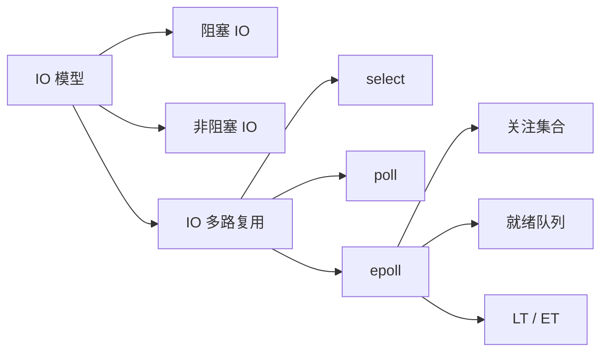

# IO 多路复用

## 一句话理解

IO 多路复用让一个线程同时等待多个 fd 的就绪事件。它解决的是“不要让大量线程阻塞在大量连接上”的问题，常用于高并发网络服务器。

## 知识点地图



## 阻塞 IO、非阻塞 IO、多路复用

| 模型 | 行为 | 关键点 |
|------|------|--------|
| 阻塞 IO | `read/accept` 没有数据或连接时，当前线程阻塞等待 | 写起来简单，但连接多时线程成本高 |
| 非阻塞 IO | 没有数据时立即返回 `-1`，`errno = EAGAIN/EWOULDBLOCK` | 不会自动回来执行，需要应用层重试或配合事件通知 |
| IO 多路复用 | 一个线程等待多个 fd 的可读/可写事件 | 先等就绪，再对就绪 fd 做实际 IO |

面试表达：

> 阻塞 IO 会让线程卡在某个 fd 上；非阻塞 IO 没有数据时立刻返回 `EAGAIN`；IO 多路复用用一个线程同时监听多个 fd，内核告诉我们哪些 fd 就绪，再去执行 `read/write/accept`。

## 为什么不能每个连接都阻塞 read

每个连接一个线程阻塞 `read`，小规模可以工作，但高并发下问题明显：

1. 大量线程占用内存。
2. 很多连接大部分时间没有数据，线程长期阻塞等待。
3. 线程调度和上下文切换成本高。
4. 连接数上来后，系统扩展性变差。

所以高并发服务器通常会用非阻塞 fd + IO 多路复用，少量线程管理大量连接。

## select、poll、epoll 对比

| 机制 | 数据结构 | 主要问题 | 适合场景 |
|------|----------|----------|----------|
| `select` | `fd_set` 位图 | fd 数量有限，通常默认 `FD_SETSIZE = 1024`；每次调用都要拷贝和线性扫描 | 小规模 fd |
| `poll` | `pollfd` 数组 | 没有 `fd_set` 固定限制，但仍要拷贝数组并线性扫描 | 中等规模 fd |
| `epoll` | 内核维护关注集合和就绪队列 | 使用更复杂，但高并发下更高效 | 大量连接、活跃连接较少 |

`select/poll` 的共同问题：

- 每次调用都要把关注的 fd 集合传给内核。
- 内核检查后，用户态还要遍历集合找哪些 fd 就绪。
- fd 很多但活跃 fd 很少时，扫描成本浪费明显。

`epoll` 的核心优势：

- 通过 `epoll_ctl` 把 fd 注册到内核。
- 内核维护关注集合，常见实现会用红黑树管理。
- fd 就绪时，内核把事件放入就绪队列。
- `epoll_wait` 直接返回就绪事件，不需要每次扫描所有 fd。

注意：不要把 `epoll` 的优势只归因于红黑树。红黑树主要用于管理关注集合，真正高效的关键是**就绪队列 + 避免全量扫描**。

## epoll 基本流程

```text
epoll_create
  -> epoll_ctl 添加 / 修改 / 删除 fd
  -> epoll_wait 等待就绪事件
  -> 对返回的 fd 执行 read / write / accept
```

可以这样理解：

```text
应用层注册关心哪些 fd
        ↓
内核维护关注集合
        ↓
fd 就绪时进入就绪队列
        ↓
epoll_wait 只取就绪队列里的事件
```

## LT 和 ET

| 模式 | 含义 | 特点 |
|------|------|------|
| LT | Level Trigger，水平触发 | 只要 fd 还处于就绪状态，就会反复通知；默认模式，安全 |
| ET | Edge Trigger，边缘触发 | 只在状态从“不就绪”变为“就绪”时通知一次；通知少，但容易漏处理 |

LT 更像是：

```text
只要缓冲区还有数据，就一直提醒你来读
```

ET 更像是：

```text
数据刚到时提醒一次，剩下的你必须一次处理干净
```

## 为什么 ET 要非阻塞并读到 EAGAIN

ET 模式只在状态变化时通知一次。如果通知来了只读了一部分数据，缓冲区里还剩数据，fd 仍然处于可读状态，但不一定会再次触发事件。

因此 ET 模式下通常要循环读取，直到 `EAGAIN/EWOULDBLOCK`：

```c
while (true) {
    n = read(fd, buf, sizeof(buf));
    if (n > 0) {
        // 处理数据
    } else if (n == -1 && errno == EAGAIN) {
        // 数据读完了，等待下一次事件
        break;
    } else if (n == 0) {
        // 对端关闭
        close(fd);
        break;
    } else {
        // 错误处理
        close(fd);
        break;
    }
}
```

如果 fd 是阻塞的，循环读到没有数据时，下一次 `read` 可能阻塞住，整个事件循环就会卡死。所以 ET 通常必须配合非阻塞 fd。

面试表达：

> LT 是状态触发，只要缓冲区还有数据就会持续通知；ET 是边缘触发，只在状态变化时通知一次。ET 下必须把数据读到 `EAGAIN`，否则剩余数据可能不会再次触发事件；为了避免读空后阻塞，fd 要设置为非阻塞。

## 容易踩坑的地方

1. 非阻塞 IO 不会“等资源就绪后自动回来执行”，没有数据时只是返回 `EAGAIN`。
2. IO 多路复用不是自动完成读写，只是告诉你哪些 fd 就绪，真正读写还要自己做。
3. `select` 不是固定 128 个 fd，常见默认限制是 `FD_SETSIZE = 1024`。
4. `poll` 解决了 `select` 的固定大小问题，但没有解决拷贝和线性扫描问题。
5. `epoll` 的优势重点是就绪队列和避免全量扫描，不只是红黑树。
6. ET 模式必须尽量一次处理干净，否则可能漏事件。
7. ET 配合阻塞 fd 容易把事件循环卡死。

## 我的薄弱点

- 非阻塞 IO 的行为边界：不会自动回来执行，需要应用层重试或事件通知。
- `select` 的 fd 数量限制表达需要准确，常见默认是 `FD_SETSIZE = 1024`。
- `epoll` 的优势不能只说红黑树，要强调就绪队列和避免扫描所有 fd。

## 成长记录

- 已能比较清楚地区分阻塞 IO、非阻塞 IO 和 IO 多路复用的使用目的。
- `select/poll/epoll` 主干掌握较好，能说出拷贝、遍历和就绪队列的差异。
- LT/ET 的核心区别表达准确：LT 不处理会持续提醒，ET 只提醒一次，需要用户处理干净。
- 后续需要复测：ET 为什么必须非阻塞，以及为什么要读到 `EAGAIN`。

## 面试高频问题

1. 阻塞 IO、非阻塞 IO、IO 多路复用分别是什么？
2. 非阻塞 `read` 没有数据时会返回什么？
3. 为什么高并发服务器不能简单地每个连接一个阻塞线程？
4. `select`、`poll`、`epoll` 有什么区别？
5. 为什么 `epoll` 更适合大量连接、少量活跃的场景？
6. `epoll` 的红黑树和就绪队列分别负责什么？
7. LT 和 ET 有什么区别？
8. 为什么 ET 模式下 fd 通常要设置成非阻塞？
9. 为什么 ET 模式下要循环读到 `EAGAIN`？
10. IO 多路复用是不是异步 IO？为什么？

## 关联知识

- [[Reactor模型]]
- [[TCP服务端连接建立]]
- [[TCP连接关闭]]
- [[文件描述符与重定向]]
- [[进程间通信]]
- [[进程与线程]]
