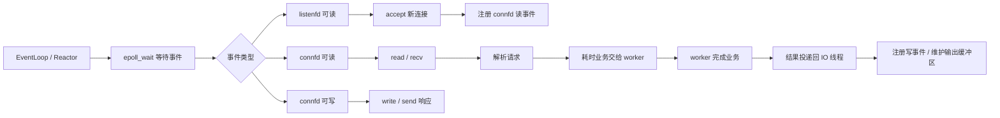

# Reactor 模型

## 一句话理解

Reactor 是事件驱动模型：由 Reactor/EventLoop 监听事件并分发给对应 handler。`epoll` 只是 Linux 下常用的事件通知机制，Reactor 不等于 `epoll`。

## 核心流程



典型流程：

1. Reactor 调用 `epoll_wait` 等待事件。
2. `listenfd` 可读：说明有新连接，执行 `accept`。
3. `connfd` 可读：读取客户端数据，解析请求。
4. 耗时业务交给 worker 线程池处理。
5. worker 完成后把结果投递回连接所属 IO 线程。
6. IO 线程维护输出缓冲区，注册写事件并发送响应。

## listenfd 和 connfd

| fd | 事件 | 处理 |
|----|------|------|
| `listenfd` | 可读 | 有新连接到来，调用 `accept` |
| `connfd` | 可读 | 客户端发来数据，调用 `read/recv` |
| `connfd` | 可写 | 发送缓冲区有空间，调用 `write/send` |

注意：可写事件通常不要一直关注，否则 socket 大多数时候都可写，会导致频繁触发。一般是输出缓冲区有待发送数据时才注册写事件，发完后取消。

## worker 为什么不直接写 socket

worker 线程主要处理耗时业务，通常不建议直接操作 socket。更稳的方式是：worker 只产出结果，再投递回连接所属 IO 线程统一发送。

原因：

1. 避免多个线程同时操作同一个连接，减少连接状态、输出缓冲区、关闭状态的并发问题。
2. 非阻塞写不一定一次写完，可能部分写入或返回 `EAGAIN`，需要 IO 线程维护剩余数据和写事件。
3. fd 生命周期更清晰，避免 worker 写到已经关闭或被复用的 fd。
4. 保持一个连接归属一个 EventLoop，减少锁和跨线程状态复杂度。

面试表达：

> worker 线程只做耗时业务，不直接操作 socket；完成后把结果投递回 IO 线程，由 IO 线程维护输出缓冲区、注册写事件并统一发送。这样能避免多线程同时操作同一 fd，也能处理非阻塞写不完整的问题。

## 常见 Reactor 形态

| 模型 | 特点 | 问题 |
|------|------|------|
| 单 Reactor 单线程 | 一个线程负责 `accept`、读写、业务 | 简单，但无法利用多核，业务阻塞会卡住所有连接 |
| 单 Reactor 多线程 | Reactor 负责 IO，业务交给 worker | 业务可并行，但 IO 线程可能成为瓶颈 |
| 主从 Reactor 多线程 | 主 Reactor 负责 `accept`，从 Reactor 负责连接 IO，worker 负责业务 | 扩展性更好，实现更复杂 |

主从 Reactor 可以理解为：

```text
Main Reactor:
  accept 新连接
        ↓
Sub Reactor:
  负责连接读写事件
        ↓
Worker Pool:
  处理耗时业务
```

## 惊群问题

惊群问题是多个进程/线程同时等待同一个事件源，当事件到来时多个等待者都被唤醒，但最终只有一个能真正处理，其他都是无效唤醒。

典型场景：多个 worker 同时等待同一个监听 socket。

```text
多个 worker 等待 listenfd
        ↓
新连接到来
        ↓
多个 worker 被唤醒
        ↓
只有一个 worker accept 成功
        ↓
其他 worker 白白唤醒，又回去等待
```

如果 `listenfd` 是非阻塞的，没抢到连接的 worker 调用 `accept` 可能返回：

```text
-1, errno = EAGAIN
```

如果是阻塞 fd，可能又睡回去。

## 惊群缓解方式

| 方式 | 思路 |
|------|------|
| 单 acceptor | 只让一个线程/进程负责 `accept`，再分发连接 |
| accept 加锁 | 多 worker 抢锁，只有拿到锁的去 `accept` |
| `EPOLLEXCLUSIVE` | 减少多个 epoll 等待者被同时唤醒 |
| `SO_REUSEPORT` | 多个进程/线程各自监听同一端口，内核做连接分发 |
| 主从 Reactor | 主 Reactor 负责 `accept`，从 Reactor 负责已连接 fd 的 IO |

面试表达：

> 惊群是多个等待者被同一个事件唤醒，但最终只有一个能处理。多进程服务器中多个 worker 同时等待同一个 listen socket 时比较典型。可以通过单 acceptor、accept 加锁、`EPOLLEXCLUSIVE`、`SO_REUSEPORT` 或主从 Reactor 缓解。

## 容易踩坑的地方

1. Reactor 不是 `epoll`，`epoll` 只是事件通知机制。
2. Reactor 不一定必须配 worker；单线程也可以是 Reactor，只是扩展性有限。
3. IO 线程不能长时间执行业务逻辑，否则会阻塞事件循环。
4. worker 不建议直接写 socket，尤其是非阻塞 socket。
5. 可写事件不能一直注册，应该在有待发送数据时关注，发送完后取消。
6. 惊群不是“多个线程都处理成功”，而是多个被唤醒，通常只有一个处理成功。

## 我的薄弱点

- Reactor 和 `epoll` 的边界：Reactor 是模型，`epoll` 是实现事件通知的机制。
- worker 写回 socket 的风险：连接所有权、非阻塞写、fd 生命周期还需要反复理解。
- 惊群问题只知道现象，`accept` 失败行为和缓解方式还需要复测。

## 成长记录

- 已能说出 Reactor 的基本方向：少量线程监听事件，耗时业务交给 worker。
- 需要提升：把“线程分发”上升到“事件分发模型”，并能说明 listenfd、connfd、handler、worker 的职责边界。

## 面试高频问题

1. 什么是 Reactor 模型？它和 `epoll` 是什么关系？
2. 基于 `epoll` 的 Reactor 服务器大概怎么工作？
3. `listenfd` 和 `connfd` 的事件分别如何处理？
4. 为什么 IO 线程不能长时间执行业务逻辑？
5. 为什么 worker 线程通常不直接写 socket？
6. 单 Reactor 单线程、单 Reactor 多线程、主从 Reactor 有什么区别？
7. 什么是惊群问题？
8. 多个 worker 同时 `accept` 同一个监听 socket 会发生什么？
9. 惊群问题有哪些缓解方式？

## 关联知识

- [[TCP服务端连接建立]]
- [[IO多路复用]]
- [[文件描述符与重定向]]
- [[进程与线程]]
