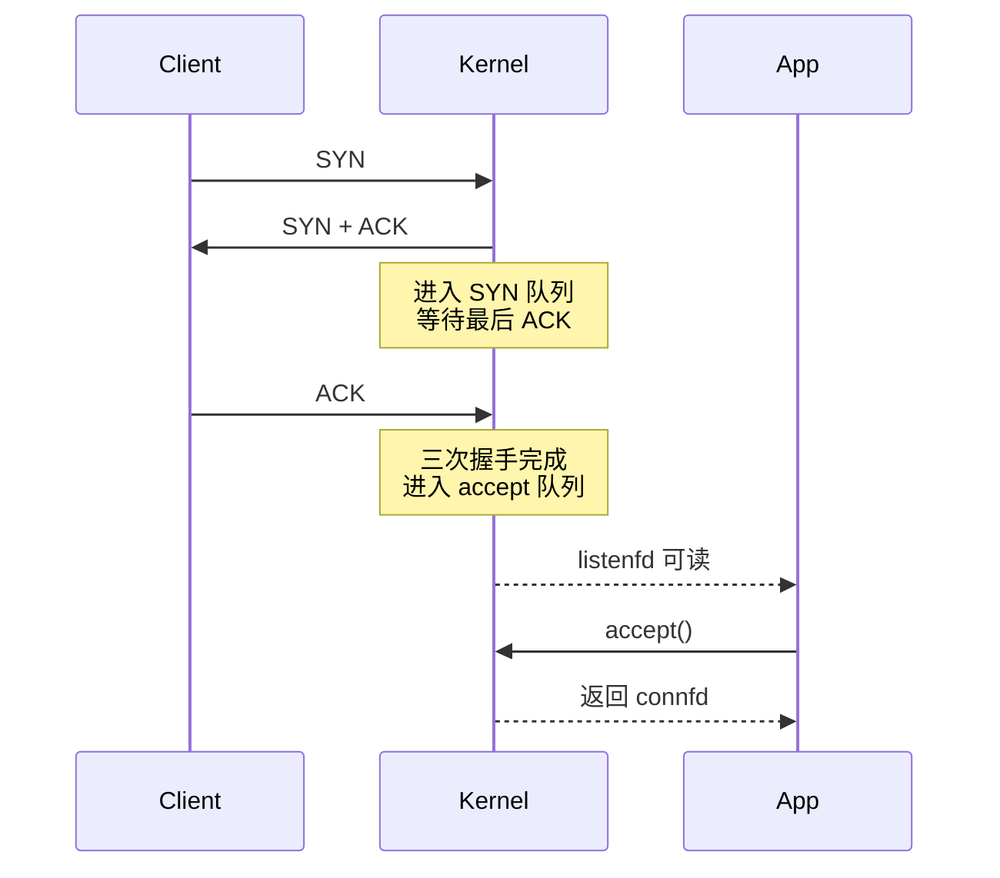

# TCP 服务端连接建立

## 一句话理解

`listenfd` 负责监听新连接，`connfd` 负责和具体客户端通信。`listenfd` 可读不是有普通数据可读，而是 accept 队列里有已经完成三次握手的连接，可以调用 `accept()` 取出来。

## 服务端 API 流程

| 调用 | 作用 |
|------|------|
| `socket()` | 创建 socket fd |
| `bind()` | 绑定本地 IP 和端口 |
| `listen()` | 把 socket 转为监听 socket，并建立连接队列 |
| `accept()` | 从已完成连接队列中取出连接，返回新的 `connfd` |

典型流程：

```text
socket
  -> bind
  -> listen
  -> accept
  -> read / write
```

## 连接建立过程



关键点：

1. 客户端发来 `SYN`。
2. 服务端收到 `SYN` 后回复 `SYN + ACK`。
3. 此时连接进入 SYN 队列，也叫半连接队列，等待客户端最后的 `ACK`。
4. 服务端收到最后的 `ACK` 后，三次握手完成。
5. 连接进入 accept 队列，也叫全连接队列。
6. 应用层调用 `accept()`，从 accept 队列取出连接，得到 `connfd`。

`accept()` 不是完成三次握手的动作，它只是把内核里已经建立好的连接取出来。

## listenfd 和 connfd

| fd | 作用 |
|----|------|
| `listenfd` | 监听新连接，只负责 `accept` |
| `connfd` | 代表某个具体客户端连接，用来 `read/write` |

`listenfd` 可读表示：

```text
accept 队列非空，可以调用 accept() 获取新连接
```

不是表示客户端发来了普通业务数据。普通业务数据要在 `accept()` 返回的 `connfd` 上读取。

## connect 成功但服务端未 accept

客户端 `connect()` 成功，说明 TCP 三次握手已经完成，但不代表服务端应用已经调用了 `accept()`。

此时状态可以理解为：

```text
客户端：connect 成功，认为连接已建立
服务端内核：连接已建立，放在 accept 队列
服务端应用：还没 accept，暂时没有 connfd
```

如果客户端提前发送数据，这些数据可以先进入服务端内核中该连接的接收缓冲区。之后服务端应用调用 `accept()` 拿到 `connfd`，再 `read(connfd)`，就可以读到之前已经到达的数据。

更准确的关系是：

```text
listenfd
  -> 监听 socket
  -> accept 队列
       -> 已建立连接的内核 socket 对象
          -> 接收缓冲区 / 发送缓冲区
          -> accept 后返回 connfd
```

重点：

> 不是先有用户态 `connfd` 才有缓冲区。连接先在内核里建立并排队，`accept()` 只是把这个已建立连接交给应用层操作。

如果服务端长期不 `accept()` 或不读取数据：

- accept 队列可能被占满，影响新连接建立。
- 已建立连接的接收缓冲区可能被填满。
- TCP 流控会让客户端发送变慢；客户端非阻塞发送可能返回 `EAGAIN`。

## ET 模式下循环 accept

如果 `listenfd` 使用 epoll ET 模式，收到可读事件后要循环 `accept()`，直到返回 `EAGAIN/EWOULDBLOCK`。

```c
while (true) {
    int connfd = accept(listenfd, ...);
    if (connfd >= 0) {
        set_nonblock(connfd);
        epoll_ctl(epfd, EPOLL_CTL_ADD, connfd, ...);
    } else if (errno == EAGAIN || errno == EWOULDBLOCK) {
        break;  // accept 队列取空
    } else if (errno == EINTR) {
        continue;
    } else {
        break;  // 真正错误
    }
}
```

原因：

- ET 只在状态变化时通知一次。
- 如果 accept 队列里有多个连接，只取一个，剩余连接可能不会再次触发边缘事件。
- 所以要一次取到 `EAGAIN`，表示队列已经取空。

这个逻辑和 ET 读数据要读到 `EAGAIN` 是同一类思路。

## backlog 和两个队列

服务端监听时通常涉及两个队列：

| 队列 | 含义 | 状态 |
|------|------|------|
| SYN 队列 | 收到 `SYN` 并回复 `SYN+ACK`，等待最后 `ACK` | 半连接 |
| accept 队列 | 三次握手完成，等待应用 `accept()` | 全连接 |

`listen(fd, backlog)` 中的 `backlog` 在现代 Linux 上主要影响 accept 队列大小，也就是已完成连接等待 `accept()` 的队列。实际上限还受系统参数影响，例如：

```text
net.core.somaxconn
net.ipv4.tcp_max_syn_backlog
```

面试里可以这样说：

> `backlog` 可以粗略理解为连接队列容量参数，但不能简单等同于“所有连接总数”。SYN 队列和 accept 队列有不同的内核参数，`backlog` 主要影响 accept 队列，实际值还会被系统上限限制。

## 队列满了会怎样

队列满时的表现和内核版本、参数有关，不要说死。

常见情况：

- SYN 队列满：可能丢弃新的 `SYN`，也可能启用 SYN cookies。
- accept 队列满：完成握手的连接无法正常进入 accept 队列，客户端可能表现为连接慢、重传、超时或失败。
- 如果配置了类似 `tcp_abort_on_overflow`，也可能直接返回 RST。

面试表达：

> 队列满时不一定立刻表现为服务端报错，客户端可能看到连接变慢、超时、重传或失败。排查时要结合 accept 速度、backlog、`somaxconn`、SYN 队列参数和是否出现 SYN flood。

## 容易踩坑的地方

1. `listenfd` 可读不是业务数据可读，而是 accept 队列里有完成连接。
2. `accept()` 不负责三次握手，只是取出已经建立好的连接。
3. SYN 队列不是“服务端还没回 SYN+ACK”的队列，而是服务端已回 `SYN+ACK`、等待最后 `ACK` 的半连接队列。
4. 客户端 `connect()` 成功不代表服务端应用已经 `accept()`。
5. `connfd` 是应用层拿到的引用；在 `accept()` 之前，内核中已经有已建立连接和缓冲区。
6. ET 模式下 `listenfd` 可读后，要循环 `accept()` 到 `EAGAIN`。
7. `backlog` 不能简单理解成最大连接数，它主要影响 accept 队列，并受内核参数限制。
8. 队列满时表现和内核参数有关，可能是重传、超时、失败或 RST。

## 我的薄弱点

- socket API 顺序知道，但内核中的 SYN 队列、accept 队列语义还需要加强。
- 半连接队列时机容易说错：服务端回复 `SYN+ACK` 后，等待客户端最后 `ACK` 的阶段才是半连接。
- `backlog` 语义不熟，需要和 accept 队列、`somaxconn`、SYN 队列参数一起理解。
- `connect()` 成功、服务端未 `accept()`、内核接收缓冲区之间的关系刚刚打通，后续需要复测。

## 成长记录

- 已能把 ET 模式“处理到 `EAGAIN`”迁移到 `accept()` 场景，说明 IO 多路复用模型正在变扎实。
- 已理解 `connect()` 成功只代表传输层连接建立，服务端应用可以稍后再 `accept()`。
- 当前主要短板从 API 记忆转向内核队列和 socket 缓冲区语义，需要后续用连接建立、队列满、排障场景继续复测。

## 面试高频问题

1. `socket()`、`bind()`、`listen()`、`accept()` 分别做什么？
2. `listenfd` 和 `connfd` 有什么区别？
3. `listenfd` 可读到底表示什么？
4. `accept()` 是否参与三次握手？
5. SYN 队列和 accept 队列分别是什么？
6. 客户端 `connect()` 成功后，服务端还没 `accept()`，客户端能先发数据吗？
7. `accept()` 前连接的接收缓冲区在哪里？
8. ET 模式下为什么要循环 `accept()` 到 `EAGAIN`？
9. `backlog` 是什么？它和两个队列有什么关系？
10. SYN 队列或 accept 队列满了会发生什么？

## 关联知识

- [[TCP连接关闭]]
- [[Reactor模型]]
- [[IO多路复用]]
- [[文件描述符与重定向]]
