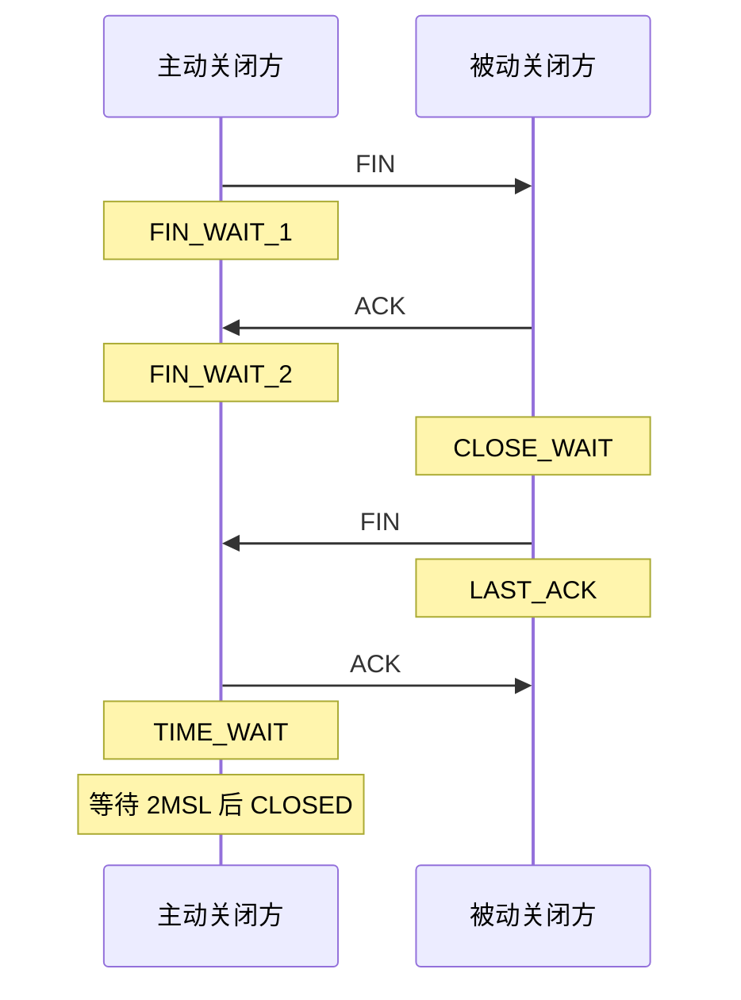

# TCP 连接关闭

## 一句话理解

TCP 连接关闭不是简单把 fd 删掉。`close()` 会触发协议栈发送 FIN，连接经过四次挥手释放；主动关闭方通常会进入 `TIME_WAIT`，被动关闭方如果应用不及时 `close()`，容易堆积 `CLOSE_WAIT`。

## 四次挥手

典型流程：



状态简化记忆：

```text
主动关闭方:
close -> FIN_WAIT_1 -> FIN_WAIT_2 -> TIME_WAIT -> CLOSED

被动关闭方:
收到 FIN -> CLOSE_WAIT -> close -> LAST_ACK -> CLOSED
```

`TIME_WAIT` 不是第一次发送 FIN 后进入，而是在主动关闭方收到对端 FIN，并回复最后一个 ACK 后进入。

## TIME_WAIT 的作用

主动关闭方进入 `TIME_WAIT`，通常等待 `2MSL`。

主要目的：

1. **保证最后一个 ACK 有机会重传**  
   如果最后的 ACK 丢了，被动关闭方会重发 FIN。主动关闭方还在 `TIME_WAIT`，可以再次回复 ACK。

2. **让旧连接的残留报文自然消失**  
   避免相同四元组的新连接被旧报文干扰。

面试表达：

> `TIME_WAIT` 是主动关闭方在发送最后一个 ACK 后进入的状态，用来保证被动关闭方能收到 ACK，并让旧连接报文在网络中消失。

## CLOSE_WAIT 的含义

`CLOSE_WAIT` 出现在被动关闭方。

流程是：

```text
对端发送 FIN
    ↓
本端内核收到 FIN 并回复 ACK
    ↓
本端连接进入 CLOSE_WAIT
    ↓
等待本端应用调用 close()
```

所以大量 `CLOSE_WAIT` 通常说明：

> 对端已经关闭连接，但本端应用没有及时调用 `close()`，可能存在 fd 泄漏或连接生命周期管理问题。

这比大量 `TIME_WAIT` 更值得警惕。

## read 返回 0

TCP socket 上：

```c
n = read(connfd, buf, sizeof(buf));
```

| 返回值 | 含义 |
|--------|------|
| `n > 0` | 读到数据 |
| `n == 0` | 对端关闭写方向，本端读到 EOF |
| `n == -1 && errno == EAGAIN` | 非阻塞模式下暂时无数据 |
| `n == -1 && errno == EINTR` | 被信号中断，可以重试 |
| 其他 `-1` | 错误 |

`read` 返回 `0` 不是“当前没数据”，而是表示对端已经发送 FIN，本端读到了 EOF。

服务端读到 `0` 后通常应该：

1. 处理连接关闭逻辑。
2. 从 `epoll` 中移除该 fd。
3. 调用 `close(connfd)`。

如果服务端读到 `0` 后不关闭 fd，连接可能长期停留在 `CLOSE_WAIT`。

## TIME_WAIT 和 CLOSE_WAIT 排查

大量 `TIME_WAIT`：

- 通常说明本机主动关闭了很多连接。
- 不一定是 bug，但可能带来端口或连接资源压力。
- 常见于短连接、高频主动关闭连接的服务。

大量 `CLOSE_WAIT`：

- 通常说明对端已经关闭，本端应用没及时 `close()`。
- 更像应用层问题：连接对象没释放、异常路径没关闭 fd、状态机漏处理。

常用查看：

```bash
ss -ant
netstat -ant
```

## close 和 shutdown

`close(fd)` 表示应用不再使用这个 fd。对 TCP socket 来说，通常会触发关闭流程；如果还有其他 fd 引用同一个 socket 对象，真正关闭要等引用都释放。

`shutdown(fd, SHUT_WR)` 可以只关闭写方向，发送 FIN，但仍可读对端数据。它更明确地表达“半关闭”。

面试里通常先讲清楚：

> `close` 释放应用持有的 fd；TCP 协议栈负责发送 FIN 并完成四次挥手。

## 容易踩坑的地方

1. `TIME_WAIT` 不是第一次发 FIN 后进入，而是发出最后一个 ACK 后进入。
2. `TIME_WAIT` 的作用不是单纯“等对端处理数据”，重点是重传最后 ACK 和清理旧报文。
3. `read` 返回 `0` 不是暂时没数据，而是对端关闭写方向。
4. 暂时没数据在非阻塞 IO 下是 `EAGAIN/EWOULDBLOCK`。
5. 大量 `CLOSE_WAIT` 通常比大量 `TIME_WAIT` 更像应用 bug。
6. `CLOSE_WAIT` 说明内核已收到对端 FIN，正在等本端应用 `close()`。

## 我的薄弱点

- `TIME_WAIT` 的进入时机和作用需要加强：不是发送第一个 FIN 后进入。
- `read=0` 的语义需要修正：表示 EOF / 对端关闭写方向，不是“当前数据读完”。
- `CLOSE_WAIT` 要和应用是否及时 `close()` 绑定理解。

## 成长记录

- 已能说出 TCP 关闭依赖四次挥手，知道对端可能还有数据要处理。
- 需要继续复测：主动关闭方状态变化、`TIME_WAIT` 的两个作用、`CLOSE_WAIT` 的排障意义。

## 面试高频问题

1. TCP 四次挥手大概怎么走？
2. 主动关闭方和被动关闭方分别会经历哪些状态？
3. `TIME_WAIT` 是什么时候进入的？为什么要等待 `2MSL`？
4. 大量 `TIME_WAIT` 说明什么？
5. `CLOSE_WAIT` 是什么？大量 `CLOSE_WAIT` 通常说明什么？
6. `read(connfd)` 返回 `0` 表示什么？
7. 读到 `0` 后服务端应该怎么处理？
8. `close()` 和 `shutdown()` 有什么区别？

## 关联知识

- [[TCP服务端连接建立]]
- [[IO多路复用]]
- [[Reactor模型]]
- [[文件描述符与重定向]]
