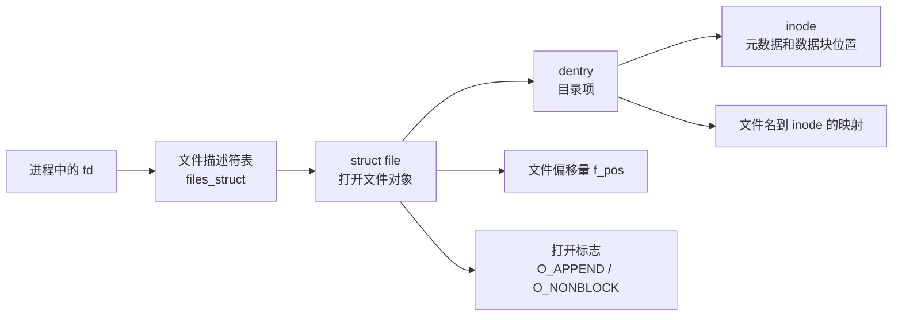

# 文件描述符与重定向

## 一句话理解

`fd` 是进程文件描述符表的下标；表项指向内核中的打开文件对象 `struct file`，文件偏移量在 `struct file` 中，而 inode 记录文件元数据和数据块位置。

## 核心关系



面试表达：

> `fd` 是进程 fd 表的下标；fd 表项指向 `struct file`，它表示一次打开文件的实例，里面有文件偏移量和打开标志；`struct file` 再关联 dentry/inode，inode 描述文件元数据和磁盘数据位置。

## fd、struct file、inode

| 概念 | 作用 |
|------|------|
| `fd` | 用户态看到的整数，本质是当前进程 fd 表下标 |
| 文件描述符表 | 每个进程维护一张表，表项指向打开文件对象 |
| `struct file` | 一次打开文件的实例，保存文件偏移量、打开标志等 |
| dentry | 目录项，负责文件名到 inode 的映射 |
| inode | 文件元数据，如权限、大小、时间、数据块位置等 |

`ls -l` 展示的权限、大小、时间等大多来自 inode；文件名来自目录项。

## dup、dup2 和 open 的区别

| 操作 | 是否共享 `struct file` | 文件偏移量是否共享 |
|------|------------------------|--------------------|
| `dup(fd)` | 是 | 共享 |
| `dup2(oldfd, newfd)` | 是 | 共享 |
| `fork()` 后父子使用继承来的 fd | 是 | 共享 |
| 两次 `open()` 同一个文件 | 否，通常是两个独立的 `struct file` | 不共享 |

`dup(fd)` 不会关闭原来的 fd，而是找一个新的最小可用 fd，让它指向同一个 `struct file`。

```c
int fd1 = open("a.txt", O_RDONLY);
int fd2 = dup(fd1);
```

此时 `fd1` 和 `fd2` 共享同一个文件偏移量。

`dup2(oldfd, newfd)` 会先关闭 `newfd`，再让 `newfd` 指向 `oldfd` 指向的 `struct file`。它不会关闭 `oldfd`。

```c
dup2(fd, STDOUT_FILENO);
```

常用于把标准输出重定向到某个文件。

两次 `open()` 同一个文件时，通常会得到两个独立的 `struct file`。它们指向同一个 inode，但各自有独立的文件偏移量。

```text
dup / dup2 / fork:
多个 fd -> 同一个 struct file -> 共享 f_pos

两次 open:
fd1 -> struct file A -> 同一个 inode
fd2 -> struct file B -> 同一个 inode
两个 struct file 各有自己的 f_pos
```

## Shell 重定向

`cmd > out.txt 2>&1` 表示：标准输出和标准错误都重定向到 `out.txt`。

Shell 从左到右处理重定向：

1. `> out.txt`：把标准输出 `fd 1` 指向 `out.txt`。
2. `2>&1`：把标准错误 `fd 2` 指向当前 `fd 1` 指向的地方。

因为此时 `fd 1` 已经指向 `out.txt`，所以最终：

```text
fd 1 -> out.txt
fd 2 -> out.txt
```

顺序不同，结果不同：

```bash
cmd > out.txt 2>&1
```

stdout 和 stderr 都到 `out.txt`。

```bash
cmd 2>&1 > out.txt
```

stderr 仍然到终端，stdout 到 `out.txt`。

原因是 `2>&1` 复制的是“当时 fd 1 的指向”，不是永远指向 stdout 这个名字。

## 覆盖写和追加写

```bash
cmd > out.txt 2>&1
```

覆盖写，底层通常类似：

```c
open("out.txt", O_WRONLY | O_CREAT | O_TRUNC, 0666);
```

`O_TRUNC` 会在打开文件时清空原内容。

```bash
cmd >> out.txt 2>&1
```

追加写，底层通常类似：

```c
open("out.txt", O_WRONLY | O_CREAT | O_APPEND, 0666);
```

`O_APPEND` 的关键点是：每次 `write` 时，内核都会把写入位置移动到文件末尾再写。这个定位动作由内核保证，不是用户自己先 `lseek` 到末尾再 `write`。

面试表达：

> `>` 是覆盖重定向，通常带 `O_TRUNC`；`>>` 是追加重定向，通常带 `O_APPEND`。`O_APPEND` 保证每次 `write` 都追加到文件末尾，避免多个进程同时追加时因为各自维护偏移量而互相覆盖。

注意：`O_APPEND` 能保证每次 `write` 的追加定位是原子的，但不代表多次 `write` 组成的一条日志天然不会交错。日志系统仍然要控制单条日志的写入边界。

## 容易踩坑的地方

1. 文件偏移量在 `struct file` 中，不在 inode 中。
2. `dup()` 不会关闭原 fd；`dup2(oldfd, newfd)` 关闭的是 `newfd`，不是 `oldfd`。
3. `dup/dup2/fork` 可能让多个 fd 共享同一个 `struct file`，因此共享文件偏移量。
4. 两次 `open()` 同一个文件通常不共享文件偏移量。
5. `2>&1` 复制的是当前 `fd 1` 的指向，重定向顺序会影响结果。
6. `>` 会截断文件，`>>` 会追加写。
7. `O_APPEND` 解决的是追加位置原子化，不等于任意日志写入都不会交错。

## 我的薄弱点

- `dup()`、`dup2()` 和两次 `open()` 对文件偏移量的影响。
- `dup2(oldfd, newfd)` 关闭的是 `newfd`，不是 `oldfd`。
- `cmd > out.txt 2>&1` 和 `cmd 2>&1 > out.txt` 的顺序差异。
- `O_TRUNC` 和 `O_APPEND` 的底层含义。

## 面试高频问题

1. `fd`、文件描述符表、`struct file`、dentry、inode 分别是什么？
2. 文件偏移量保存在哪里？
3. `dup()`、`dup2()` 和两次 `open()` 的文件偏移量有什么区别？
4. `dup2(oldfd, newfd)` 会关闭哪个 fd？
5. `fork()` 后父子进程继承来的 fd 是否共享文件偏移量？
6. `cmd > out.txt 2>&1` 的含义是什么？
7. `cmd > out.txt 2>&1` 和 `cmd 2>&1 > out.txt` 有什么区别？
8. `>` 和 `>>` 有什么区别？
9. `O_TRUNC` 和 `O_APPEND` 分别有什么作用？
10. 多进程追加写日志时，为什么通常需要 `O_APPEND`？

## 关联知识

- [[inode与软硬链接]]
- [[IO多路复用]]
- [[进程与线程]]
- [[进程间通信]]
- [[内存管理]]
