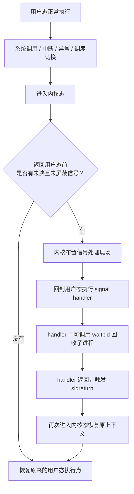

# 进程状态与回收

## 一句话理解

进程退出后不等于立刻从系统中彻底消失。子进程退出后需要父进程通过 `wait/waitpid` 回收退出状态，否则会短暂或长期停留为僵尸进程。

## 进程常见状态

| 状态 | 含义 | 面试重点 |
|------|------|----------|
| `R` | Running / Runnable，正在运行或在运行队列等待 CPU | Linux 里 `R` 包含运行和就绪 |
| `S` | Interruptible Sleep，可中断睡眠 | 等待事件，可被信号唤醒 |
| `D` | Uninterruptible Sleep，不可中断睡眠 | 常见于内核 IO 等待，不响应普通信号 |
| `T` | Stopped，暂停或被调试 | 常见于 `SIGSTOP`、调试器 |
| `Z` | Zombie，僵尸进程 | 子进程已退出，父进程未回收 |

面试表达：

> `R` 表示正在运行或可运行；`S` 是可中断睡眠；`D` 是不可中断睡眠，常见于内核态 IO 等待；`Z` 是子进程已经退出但父进程还没有回收退出状态。

## 僵尸进程

僵尸进程不是“还没死”，而是**已经退出，但父进程还没回收它的退出状态**。

子进程退出后，大部分资源已经释放，比如用户态地址空间、堆、栈、文件描述符等；系统只保留少量内核信息：

- PID
- 退出状态
- 资源使用统计
- 少量 task 相关结构

所以僵尸进程通常不占用 CPU，也不会占用大量用户态内存。大量僵尸进程真正危险的是占用 PID 和进程表项，可能导致新进程创建失败。

## 孤儿进程

孤儿进程是父进程先退出、子进程还在运行的进程。内核会把它重新托管给 1 号进程，例如 `init` 或 `systemd`。

孤儿进程退出后也会产生退出状态，但通常会被 1 号进程及时回收，所以一般不会长期残留为僵尸进程。

| 类型 | 产生原因 | 谁回收 |
|------|----------|--------|
| 僵尸进程 | 子进程已退出，父进程没 `wait` | 原父进程 |
| 孤儿进程 | 父进程先退出，子进程还活着 | 1 号进程或 subreaper |

## wait 和 waitpid

父进程避免僵尸进程，核心就是回收子进程退出状态。

```c
wait(&status);
waitpid(pid, &status, options);
```

| 接口 | 特点 |
|------|------|
| `wait()` | 等待任意一个子进程退出，通常会阻塞 |
| `waitpid()` | 可以指定子进程；配合 `WNOHANG` 可以非阻塞回收 |

常见写法：

```c
while (waitpid(-1, &status, WNOHANG) > 0) {
    // 回收所有已经退出的子进程
}
```

`SIGCHLD` 只是通知父进程“子进程状态可能变化了”，不会自动回收子进程。真正回收动作仍然要靠 `wait/waitpid`。

## SIGCHLD 为什么要循环 waitpid

普通信号通常不排队。多个子进程几乎同时退出时，父进程可能只看到一次 `SIGCHLD`。

```text
子进程 A 退出 -> SIGCHLD pending
子进程 B 退出 -> SIGCHLD 已经 pending，不再额外排一个
父进程处理 SIGCHLD -> handler 可能只被调用一次
```

所以收到一次 `SIGCHLD` 后，要循环调用：

```c
waitpid(-1, &status, WNOHANG);
```

一次性把所有已经退出的子进程都回收掉。`WNOHANG` 的作用是：没有已退出子进程时不阻塞，直接返回。

面试表达：

> `SIGCHLD` 不是可靠队列，只是通知；`waitpid` 才是可靠回收。收到信号后循环 `waitpid(-1, &status, WNOHANG)`，可以避免多个子进程同时退出时漏回收。

## 信号处理模型

用户态程序不是每执行一条指令都检查信号。信号检查通常发生在内核准备返回用户态的边界，比如系统调用返回、中断返回、异常返回、调度后恢复执行。



可以按“倒八字模型”理解：

1. 程序因为系统调用、中断、异常等原因进入内核态。
2. 内核准备返回用户态前，检查当前线程是否有未决且未屏蔽的信号。
3. 如果有，内核不直接执行 handler，而是布置好用户态现场。
4. 程序回到用户态后先执行用户注册的 signal handler。
5. handler 返回时通过 `sigreturn` 再进入内核，恢复原来的上下文。
6. 最后回到原程序被打断的位置继续执行。

重点：

> 信号负责通知，handler 在用户态执行；真正需要内核完成的事情，例如 `waitpid` 回收子进程，要在 handler 中通过系统调用再次进入内核。

## 容易踩坑的地方

1. 把僵尸进程理解成“还没死”：实际是已经退出，只是父进程没回收退出状态。
2. 认为僵尸进程占用大量内存：通常只占用少量内核资源，主要风险是 PID 和进程表项耗尽。
3. 认为孤儿进程不会进入僵尸状态：退出时也会产生退出状态，只是通常被 1 号进程及时回收。
4. 认为收到 `SIGCHLD` 就自动回收：不会，必须调用 `wait/waitpid`。
5. 认为一个子进程退出一定对应一次可处理的 `SIGCHLD`：普通信号不可靠排队，多个信号可能合并。
6. 认为 signal handler 在内核态执行：handler 是用户态函数，内核只负责布置信号处理现场。

## 我的薄弱点

- 僵尸进程保留的是少量内核信息，不是大量用户态内存。
- 孤儿进程和僵尸进程的关系：孤儿退出后也需要被回收，只是通常由 1 号进程处理。
- `SIGCHLD` 的通知语义：信号可能合并，回收要靠循环 `waitpid`。
- 信号处理模型：内核在返回用户态前检查信号，handler 在用户态执行。

## 面试高频问题

1. Linux 进程常见状态有哪些？`R/S/D/T/Z` 分别表示什么？
2. `D` 状态为什么危险？为什么普通 `kill` 不一定杀得掉？
3. 什么是僵尸进程？它占用哪些资源？
4. 大量僵尸进程为什么有问题？
5. 什么是孤儿进程？谁负责回收孤儿进程？
6. 父进程如何避免产生僵尸进程？
7. `wait()` 和 `waitpid()` 有什么区别？
8. 为什么 `SIGCHLD` handler 里要循环 `waitpid(-1, &status, WNOHANG)`？
9. 普通信号为什么可能丢失或合并？
10. signal handler 是在用户态执行还是内核态执行？

## 关联知识

- [[进程与线程]]
