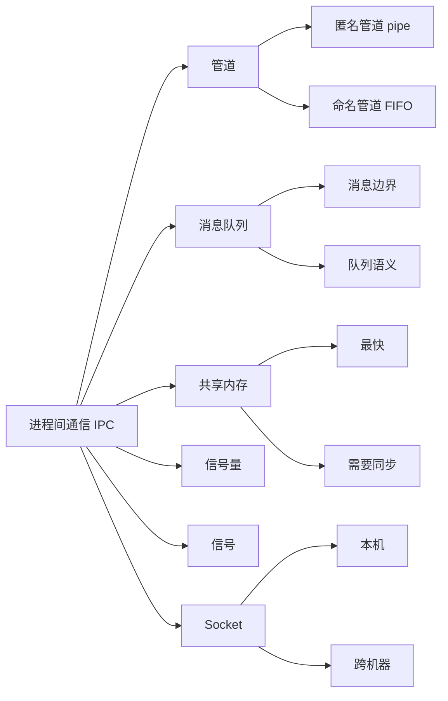

# 进程间通信

## 一句话理解

进程之间地址空间隔离，不能像线程一样直接共享变量，所以需要 IPC 机制传递数据或同步状态。面试重点不是背 API，而是能说清楚每种方式适合什么场景。

## 知识点地图



## IPC 方式总览

| 方式 | 特点 | 典型场景 |
|------|------|----------|
| 匿名管道 `pipe` | 半双工、字节流、无路径名 | 父子进程、shell 管道 |
| 命名管道 FIFO | 半双工、字节流、有文件路径 | 本机无亲缘关系进程简单通信 |
| 消息队列 | 一条条消息，有消息边界和队列语义 | 小块结构化消息、控制命令、事件通知 |
| 共享内存 | 多进程映射同一块物理内存，速度快 | 大量数据、高频数据交换 |
| 信号量 | 不传数据，主要做同步/互斥 | 常配合共享内存使用 |
| 信号 | 异步通知，信息量少 | 进程退出、状态变化、简单控制 |
| Socket | 可本机可跨机器，支持双向通信 | 客户端/服务端、网络通信、Unix Domain Socket |

面试表达：

> 小消息和控制命令优先考虑消息队列或 Unix Domain Socket；大量数据和高频交换可以考虑共享内存，但必须额外设计同步机制。

## 管道和 FIFO

单个管道是半双工的，只适合一个方向的数据流。如果要双向通信，通常需要两个管道，或者使用 `socketpair`。

匿名管道没有文件系统路径名，但有文件描述符：

```c
int pipefd[2];
pipe(pipefd);
// pipefd[0] 读端
// pipefd[1] 写端
```

父进程创建匿名管道后，子进程通过 `fork()` 继承文件描述符，所以匿名管道通常用于有亲缘关系的进程。

命名管道 FIFO 有文件系统路径：

```bash
mkfifo /tmp/myfifo
```

无亲缘关系的进程只要知道路径并且权限允许，就可以 `open("/tmp/myfifo")` 接入同一个 FIFO。

## 管道读写端关闭行为

| 场景 | 行为 |
|------|------|
| 写端全部关闭，读端 `read` | 管道中还有数据就先读；读完后返回 `0`，表示 EOF |
| 读端全部关闭，写端 `write` | 通常触发 `SIGPIPE`；如果忽略/捕获该信号，`write` 返回 `-1`，`errno = EPIPE` |
| 管道为空但写端没关，读端 `read` | 阻塞等待数据；非阻塞模式返回 `EAGAIN/EWOULDBLOCK` |
| 管道满但读端没关，写端 `write` | 阻塞等待空间；非阻塞模式返回 `EAGAIN/EWOULDBLOCK` |

这个点常用来考察你是否理解“文件描述符引用是否全部关闭”。只要还有任意进程持有写端，读端就不会读到 EOF。

## 共享内存

共享内存快，是因为多个进程把同一段内存映射到自己的虚拟地址空间，读写时像访问普通内存一样，本质上通过页表映射到同一批物理页。

优点：

- 数据不需要在用户态和内核态之间反复拷贝。
- 适合大块数据和高频数据交换。

问题：

- 不自带同步，多进程同时读写会产生竞态。
- 生命周期管理更复杂，需要创建、映射、解除映射、删除。
- 数据结构设计更难，一个进程崩溃可能留下脏状态。
- 共享内存中不要直接放普通指针，因为不同进程中的虚拟地址可能不同；通常用偏移量代替指针。

共享内存通常需要配合信号量、进程间共享互斥锁、条件变量、文件锁或 futex 等同步机制。

## 消息队列和共享内存对比

| 对比点 | 消息队列 | 共享内存 |
|--------|----------|----------|
| 数据形态 | 一条条消息，有边界 | 一块内存区域，没有天然消息边界 |
| 拷贝成本 | 通常经过内核队列，有拷贝开销 | 映射后直接读写，速度快 |
| 同步能力 | 队列本身提供入队/出队和阻塞语义 | 不自带同步，需要自己设计 |
| 适合场景 | 小块结构化消息、事件通知、控制命令 | 大量数据、高频交换 |
| 复杂度 | 相对简单 | 同步、生命周期、崩溃恢复更复杂 |

选型表达：

> 小消息、控制命令、事件通知，用消息队列更清晰；大块数据、高频交换、性能要求高，用共享内存，但要额外设计同步机制。

## 日志服务选型

场景：多个业务进程不断产生日志，一个日志进程负责收集并写文件。

优先选择：消息队列或 Unix Domain Socket。

理由：

1. 日志天然是一条条记录，适合消息模型。
2. 多业务进程是多生产者，日志进程是单消费者，符合生产者-消费者模型。
3. 队列本身提供缓冲、入队/出队和阻塞语义，业务进程不需要自己管理共享内存同步。
4. 实现简单，可靠性和可维护性更好。

如果日志量极高，可以考虑共享内存环形队列，但要额外处理同步、覆盖策略、丢日志策略和崩溃恢复。

## 容易踩坑的地方

1. 匿名管道不是没有 fd，而是没有路径名；它依靠 `fork()` 继承 fd。
2. 命名管道不是普通文件存数据，而是通过路径找到内核中的 FIFO 通信对象。
3. 管道写端没有全部关闭时，读端不会读到 EOF。
4. 读端全部关闭后继续写管道，通常会收到 `SIGPIPE`。
5. 共享内存快，但不负责同步；同步问题必须自己解决。
6. 共享内存中不要直接保存普通指针，跨进程可能无效。
7. 信号量主要是同步机制，不是主要的数据传输方式。

## 我的薄弱点

- 匿名管道“无路径名”和“仍然有文件描述符”的区别。
- 管道读写端全部关闭后的 `read/write` 行为，尤其是 EOF、`SIGPIPE`、`EPIPE`。
- 共享内存虽然快，但必须额外处理同步、生命周期和指针偏移问题。
- IPC 选型要结合数据量、消息边界、同步复杂度和是否跨机器。

## 面试高频问题

1. Linux 进程间通信方式有哪些？分别适合什么场景？
2. 匿名管道和命名管道有什么区别？
3. 为什么匿名管道通常用于有亲缘关系的进程？
4. 单个管道是单向还是双向？如何实现双向通信？
5. 管道写端全部关闭后，读端 `read` 返回什么？
6. 管道读端全部关闭后，写端 `write` 会发生什么？
7. 为什么共享内存是最快的 IPC？
8. 共享内存有什么问题？为什么需要同步机制？
9. 消息队列和共享内存如何选型？
10. 多进程日志服务适合用哪种 IPC？为什么？

## 关联知识

- [[进程与线程]]
- [[进程状态与回收]]
- [[文件描述符与重定向]]
- [[IO多路复用]]
- [[内存管理]]
