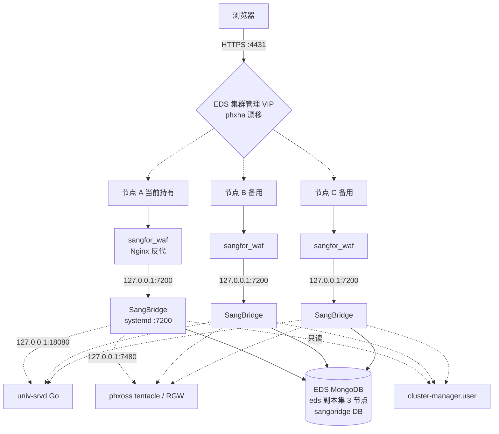
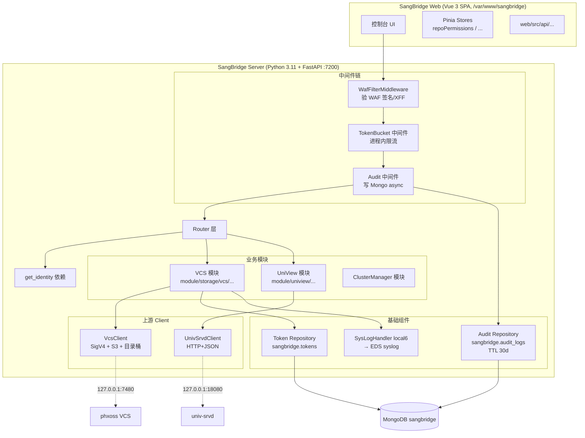
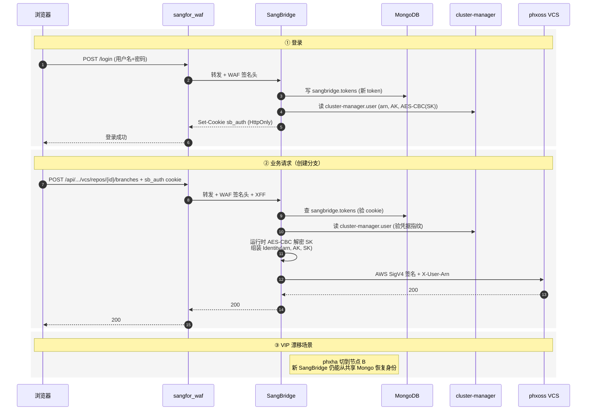

# SangBridge AI统一接入与管理控制台

> **视角**：整个项目是我的。**唯一边界**：phxoss VCS 是上游数据面（由 phxoss 团队负责）。
> **本笔记用途**：项目理解——架构、模块、机制、边界。
> **VCS 个人贡献 + 面试素材**见 [[SangBridge AI统一接入与管理控制台 - 面试素材]]。

## 项目定位

SangBridge 面向 EDS 5.3.2，以 Vue 3 控制台和 Python 3.11/FastAPI 网关统一接入 VCS、UniView 等 AI 与基础设施上游服务：

```text
用户 -> SangBridge Web / FastAPI 网关 -> phxoss VCS、UniView 等上游服务
```

系统负责统一界面、登录身份、上游请求转发、错误转换、审计、限流和部署测试等能力。本人已核验的主要贡献聚焦 **VCS 管控面**：权限治理与游标分页正确性；登录、Token、WAF、审计、SigV4/S3 Express 和底层 phxoss/univ-srvd 实现不计入个人成果。


## 架构设计

> 视角：整个项目是我的。从全局视角梳理 SangBridge 的部署、模块、数据流。这部分用于建立**架构骨架**，具体模块细节在后续"## 核心模块设计"/"## 网关机制"段落中深挖。

> 视角：整个项目是我的。从全局视角梳理 SangBridge 的部署、模块、数据流。这部分用于建立**架构骨架**，具体模块细节在后续"## 核心代码"/"## 调试记录"等段落中深挖。

### 部署架构



**部署关键设计权衡**：

| 维度 | 现状 | 设计意图 |
|---|---|---|
| 部署形态 | 宿主机 RPM + systemd（后端 Wheel 装在 Python 3.11 site-packages） | 跟 EDS 节点同生命周期，5.3.2 起已不再用 chroot |
| HA 方式 | phxha 漂移 VIP | 被动热备，**非**主动-主动负载均衡；正常时一个 VIP 对应一个承载节点 |
| 流量入口 | sangfor_waf（Nginx，仓库外） | TLS + WAF 规则 + 反代 + 静态资源；WAF 配置由 EDS 基础设施维护 |
| 端口暴露 | SangBridge 仅监听 127.0.0.1:7200 | 实际入口和安全边界都是 WAF；外部不能直连 SangBridge |
| 集群规模 | 随 EDS 节点数 | 无 SangBridge 专属固定副本数或自动扩缩容 |
| 重配置机制 | cluster-manager 遍历 hosts → `systemctl restart sangbridge.service` | 节点加/减时自动同步 |
| 跨节点用户体验 | "节点 A 登录 → VIP 切到 B → 同 token 继续可用" | session 不存本机，依赖共享 Mongo 恢复身份 |

### 模块拆分



**模块关键点**：

- **每个上游一个专用 client**（不是统一泛化 client）—— 协议和认证差异太大（VCS 要 SigV4/S3，UniView 只要 JSON 头）
- 中间件链是**洋葱结构**：`WafFilter → RateLimit → Audit → Router`
- **限流/审计/并发 limiter 都是进程内的**——不跨节点共享（关键设计权衡）
- 前端 Pinia Store 做权限缓存（按 `repoId`），仓库切换重新加载

### 关键数据流：登录 → 调 VCS



**身份传递关键点**：

- 浏览器只拿 `sb_auth` HttpOnly cookie，**永远不接触** ARN/AK/SK
- 每次请求 SangBridge 从 Mongo `sangbridge.tokens` 查 cookie
- 再回查 `cluster-manager.user` 验凭据指纹（密码/AK/SK 轮换**立即生效**）
- 运行时 AES-CBC 解密 SK → 内存中的 Identity(arn, AK, SK)
- 调 VCS 用 **AWS SigV4**（service=s3）+ 审计关联头 `X-User-Arn: <plain ARN>`
- 调 UniView 用 `X-IFGW-User: base64(JSON({user_arn, is_admin}))`（**不**是 X-User-Arn 旧协议）
- 调 VCS 时若用户无 AK/SK → 返回 `VCS-CREDENTIALS-MISSING`，**不降级**为服务账号

### 关键中间件与外部依赖

| 类别 | 实现 | 备注 |
|---|---|---|
| 数据库 | MongoDB（EDS 副本集 3 节点） | sangbridge 库存 `tokens` + `audit_logs`；只读 `cluster-manager.user` |
| 缓存 | **无** | 进程内限流、目录桶凭据缓存都是单机 |
| 消息队列 | **无** | 审计是进程内异步写 Mongo |
| 日志 | Python `logging` → `SysLogHandler(local6)` → EDS syslog | 落盘 `/sf/log/today/sangbridge.log` |
| 监控 | **无** Prometheus / Grafana 接入 | 故障定位纯靠日志 |
| WAF | `sangfor_waf`（Nginx，仓库外） | TLS + WAF 规则 + 反代；WAF 配置在 EDS 基础设施 |
| 应用内 WAF 防御 | `WafFilterMiddleware` | 验证 `Y-Forwarded-For`/`Y-HMAC-For`，只信任受信代理发来的 XFF |
| 限流 | 自研 FastAPI 中间件 + 进程内 Token Bucket | 用户桶 300 容量/秒补 10；IP 桶 600 容量/秒补 20；上传端点独立大桶 |
| 审计 | 自研中间件，异步写 Mongo `audit_logs` | TTL 默认 30 天；**默认 `audit.enabled=false`** |
| 并发保护 | 进程内 VCS 上传/下载/ZIP limiter | 非分布式 |
| `/metrics` | 暂无 | 监控接入缺失点 |

### 上游服务连接

| 上游 | 默认地址 | 协议 | 认证方式 | Client |
|---|---|---|---|---|
| univ-srvd (UniView) | `127.0.0.1:18080/api/v1` | HTTP + JSON REST | `X-IFGW-User: base64(JSON)` | `UnivSrvdClient` |
| phxoss tentacle / RGW (VCS) | `127.0.0.1:7480` | HTTP；控制面 VCS REST + 数据面 S3 兼容 | **AWS SigV4** (service=s3) | `VcsClient` |
| cluster-manager | 内部 | 只读 user 表 | — | 直接 Mongo 读 |

**关键设计点**：

- 默认本机 loopback 共置，地址都通过 `upstream.*.base_url` 可覆盖
- 没有 gRPC，没有"内部 SDK 嵌入上游"——用 `httpx.AsyncClient` 连接池发真实 HTTP
- 多上游分别用专用 client，因为协议和认证差异大；配置统一在 `upstream` 模块
- UniView 各领域模块（Catalog/Search/Source/Promote）复用同一个 app 级 `UnivSrvdClient`
- `VcsClient` 同时覆盖 VCS 控制面 REST 与 S3 数据面（统一处理 SigV4、对象流式、Multipart、目录桶 Session）
- 目录桶（`--x-s3` 后缀）特殊流程：用户 IAM AK/SK 签 `GET /{bucket}?session` → 拿短期凭据 → 缓存 5 分钟 / LRU 1024 → 后续用 S3ExpressAuth 签

### 关键架构薄弱点（后续深挖入口）

1. **限流不跨节点** — 进程内 Token Bucket，VIP 漂移后用户桶重新计数；攻击者通过 VIP 漂移可绕过单节点限流（用户桶 300/s × N 节点 = N×300/s）
2. **审计默认关闭** — `audit.enabled=false` 是默认生产配置；写操作无痕，安全事件无追溯依据
3. **WAF 在仓库外** — 改 WAF 配置（签名密钥、超时、规则）会绕过 SangBridge CI，需要独立变更流程
4. **session 不存本机** — 每次请求都回查 Mongo `tokens` + `cluster-manager.user`；高并发下 Mongo 可能成瓶颈
5. **AK/SK 在 Mongo 库内是 AES-CBC 加密** — 加密密钥在哪？谁解密？轮换策略？失守的爆炸半径需要评估
6. **没 Redis** — 所有"分布式"功能（限流、缓存、幂等、防重）都缺基础组件
7. **没 Prometheus** — 故障时无指标可查；纯靠 `/sf/log/today/sangbridge.log` 定位
8. **S3 Express Session 缓存** — 5 分钟 LRU 1024 桶，过期边界、凭据轮换兼容性、与目录桶快速删除的兼容性都需要验证
9. **VIP 漂移时旧请求处理** — 节点切换瞬间在飞请求会失败，重试策略？用户体验？
10. **CI/CD 流程不清晰** — 笔记里提"CI 镜像"但没流程；后端 RPM 构建、前端 build、EDS 节点部署的链路需要梳理

### 事实边界更新（按"整个项目是我的"视角）

> 原"## 事实边界"段落是 **VCS 视角**的事实边界（哪些工作是我的）。从"整个项目"视角看，那些边界变成了"需要深入理解的模块"。本节列出**架构层面**的事实边界。

| 旧笔记内容 | 实际情况 | 备注 |
|---|---|---|
| `X-User-Arn: <plain ARN>` 用于 UniView | **旧协议已废弃**；当前用 `X-IFGW-User` (Base64 JSON) | VCS 仍用 `X-User-Arn`（审计关联头，不是授权主体） |
| "登录 Token WAF 审计 SigV4/S3 Express 不计入个人成果" | 从"整个项目是我的"视角，这些**都是 SangBridge 的一部分**，要全部搞懂 | 之前是 VCS 视角的边界；新视角下边界变成"需要深入理解的模块" |
| 默认生产 `audit.enabled=false` | 笔记没提——**审计默认关闭** | 架构薄弱点 #2 |
| WAF 在仓库外 | 笔记没提 | 架构薄弱点 #3 |
| 限流不跨节点 | 笔记没提——进程内 Token Bucket | 架构薄弱点 #1 |
| 没 Redis / 消息队列 / Prometheus | 笔记没提 | 架构薄弱点 #6 #7 |
| 凭据解密 / AES-CBC 密钥管理 | 完全空白 | 架构薄弱点 #5 |
| CI/CD 流程 | 笔记里提"CI 镜像"但没流程 | 架构薄弱点 #10 |

## 核心模块设计

> 视角：从整个项目设计意图出发，讲清每个模块"是什么 / 为什么这样设计 / 关键设计点"。

### VCS 模块

VCS 模块是 SangBridge 管控面最核心的模块之一，对接 phxoss 数据面（边界外），提供仓库、分支、标签、提交、MR、S3 对象存储的访问能力。

#### 核心职责

- **VCS 控制面 REST**：仓库、分支、标签、提交、MR、对比的 VCS REST 调用（按 `phxoss /vcs/v1/*` 接口）
- **数据面 S3 兼容**：对象上传下载、Multipart、目录桶 Session（通过 phxoss tentacle / RGW，S3 兼容 API）
- **权限治理子模块**：消费上游 `/permissions` 权限集合，做"按钮能力 → 请求前校验 → 上游最终授权"的分层
- **游标分页子模块**：统一 `truncated/after`、opaque cursor、S3 continuation token 的消费语义

#### 权限治理子模块（核心机制）

**设计目标**：让控制台状态与数据面策略一致，提前阻止误操作和无效请求；安全边界仍是 phxoss Bucket Policy。

**完整调用链**：

```text
ResourceDetail(route.params.id)
  → repoPermissionsStore.load(repoId)
  → repoApi.permissions(repoId)
  → GET /api/sangbridge/v1/vcs/repos/{repoId}/permissions
  → RepoMgr / VcsClient
  → GET phxoss /vcs/v1/repos/{repoId}/permissions
  → Action、Button、Method+URL 权限集合
  → useRepoPermissions 生成 canCreate/canDelete/canGetDiff 等能力
  → 按钮置灰 + 部分 Handler 请求前拦截
  → SangBridge 转发用户身份，phxoss Bucket Policy 最终授权
```

**关键设计点**：

- SangBridge VCS Router 用 `Depends(get_identity)` 取得登录身份，以 `X-User-Arn` 与 SigV4 签名向 phxoss 转发
- phxoss 权限响应含 `bucket_name`、`user`、`is_owner`、`apis[]`；前端按 IAM Action / Button 标识 / Method+URL 三种方式匹配
- 权限数据按 `repoId` 缓存，仓库切换会重新加载
- **权限四类条件**共同决定：上游权限集合 + 当前仓库角色 + 资源创建人归属 + 页面业务条件
  - `admin`：可操作任意创建人资源
  - `developer`：只能操作 `creator_id == 当前用户名` 的资源
  - `visitor`：不允许写操作；角色未加载时按不可操作处理
  - 业务条件：默认分支不可删、源/目标必须都是分支、源分支归属不明确禁提 MR

**前端涉及页面**：`BranchTab.vue`、`TagTab.vue`、`CommitTab.vue`、`CompareTab.vue`、`NewPRModal.vue`、`PRApprovalModal.vue`

**前端关键代码路径**：

- `web/src/views/vcs/ResourceDetail.vue`
- `web/src/stores/repoPermissions.ts`
- `web/src/composables/useRepoPermissions.ts`
- `web/src/api/vcs/index.ts`

**后端关键代码路径**：

- `server/sangbridge_server/module/storage/vcs/repo/web_api/router.py`
- `server/sangbridge_server/module/storage/vcs/repo/manager/repo_mgr.py`
- `server/sangbridge_server/client/phxoss/vcs/vcs_client.py`

#### 游标分页子模块（核心机制）

**设计目标**：以后端 `truncated/after` 为唯一可信源，前端不臆测下一页；不同分页语义（普通 after、opaque cursor、S3 continuation token）需要清晰区分。

**核心契约**：

- **普通 cursor**（仓库/分支/标签列表）：`truncated: bool` + `after: str` —— 前端用 `after` 当下一次请求参数
- **opaque cursor**（提交图/树形结构）：后端返回 base64 编码的不透明 cursor，前端**不能**解析
- **S3 continuation token**（快照文件树）：从 S3 ListObjectsV2 返回的 `NextContinuationToken`，不能混淆为普通 cursor

**关键修复点**（机制层面）：

- **exact-page 假下一页**：之前前端用 "current + 1" 推算下一页，遇到 truncated=true 但 `after` 不前进时就翻错。修复：以后端返回的 `after` 为准
- **S3 快照 token 错用**：之前用普通 `after` 当 S3 token 传给 S3 API。修复：明确区分两类 cursor
- **仓库超过 50 条无法继续**：默认 page size 设了硬上限。修复：分页契约统一到 `truncated/after`，无硬上限
- **快照漏数据**：游标构造错位导致跳页。修复：cursor 构造在 client 层封装，调用方不直接处理

**后端测试覆盖**（涉及 py 集成测试）：

- `server/tests/integration/vcs/test_branch_router.py`
- `server/tests/integration/vcs/test_tag_router.py`
- `server/tests/integration/vcs/test_commit_router.py`
- `server/tests/integration/vcs/test_workspace_router.py`
- `server/tests/unit/vcs/test_workspace_mgr.py`
- `server/tests/unit/client/test_vcs_client_coverage.py`

**已知薄弱点**：仓库 Router `GET /repos?limit=&after=` 集成测试；后端 exact-page 契约；空页但 `truncated=true`、`after` 不前进等异常契约；三页以上翻页和回退；仓库切换后的旧请求覆盖；搜索与翻页并发；S3 token 失效/变化；以及上游重叠数据的去重策略。

### UniView 模块

> **状态**：待补全——目前掌握信息有限（只通过 UnivSrvdClient 接入）。需要后续梳理：

- 内部领域模块（Catalog / Search / Source / Promote）的具体职责
- 与 VCS 模块的差异（身份头 vs SigV4）
- 数据流转：SangBridge 业务操作 → UnivSrvdClient → univ-srvd 各领域服务

### ClusterManager 模块

> **状态**：待补全——目前只通过只读 user 表接入。需要后续梳理：

- sangbridge 对 cluster-manager 的接口范围
- EDS 集群重配置逻辑
- 用户/凭据/ARN 的生命周期管理

## 网关机制

> 视角：SangBridge 作为 FastAPI 网关，对外统一控制台流量入口，对内转发到上游服务。这一节讲清 SangBridge 网关的核心机制设计。

### 中间件链（洋葱结构）

请求按以下顺序穿过中间件：

```text
HTTP 请求
  → WafFilterMiddleware（验 WAF 签名/XFF）
  → TokenBucket 中间件（进程内限流）
  → Audit 中间件（写操作异步写 Mongo audit_logs）
  → Router 层（业务处理）
```

### 身份与转发

- `Depends(get_identity)` 注入登录身份（从 `sb_auth` cookie → sangbridge.tokens → cluster-manager.user）
- 上游转发用各 client 自己的认证机制：
  - VCS：AWS SigV4（service=s3），运行时 AES-CBC 解密 SK
  - UniView：`X-IFGW-User: base64(JSON({user_arn, is_admin}))`
  - ClusterManager：只读 Mongo，无认证转换
- 凭据轮换**立即生效**（每次请求都回查 user 表验指纹）

### 限流

- **自研 FastAPI/Starlette 中间件 + 进程内 Token Bucket**
- 默认阈值：用户桶 300 容量/秒补 10；IP 桶 600 容量/秒补 20
- 上传端点独立大桶
- **架构权衡**：进程内实现，**不跨节点共享**——VIP 漂移后用户桶重新计数（见[[#关键架构薄弱点]]#1）

### 审计

- 自研中间件，**写操作**（POST/PUT/PATCH/DELETE）异步写 Mongo `sangbridge.audit_logs`
- TTL 默认 30 天
- **架构权衡**：**默认 `audit.enabled=false`**——生产需运维显式打开（见[[#关键架构薄弱点]]#2）

### WAF 防御

- **外层 WAF**：`sangfor_waf`（Nginx，仓库外）承担 TLS + WAF 规则 + 反代
- **应用内 WAF 防御**：`WafFilterMiddleware` 验证 WAF 签名的 `Y-Forwarded-For`/`Y-HMAC-For`，只信任受信代理发来的 XFF
- WAF `/open/api/` 代理超时 6000 秒

### 访问日志

- 每个 HTTP 请求由 `WafFilterMiddleware` 记录 access log
- 走 Python `logging` → `SysLogHandler(local6)` → EDS syslog → `/sf/log/today/sangbridge.log`
- **注意**：访问日志 ≠ 审计日志——访问日志是每个请求，审计只针对写操作

## 项目边界

按"整个项目是我的"视角，**唯一边界**是：

- **phxoss VCS 上游是数据面**（由 phxoss 团队负责）
  - SangBridge 通过 VcsClient 消费 phxoss 的 VCS REST API 和 S3 兼容 API
  - phxoss 的 Bucket Policy 是 SangBridge VCS 模块的最终授权边界
  - 权限契约（`/permissions` API、IAM Action 等）由 phxoss 团队定义，SangBridge 适配
  - phxoss 的 RGW 改造、tentacle 服务、底层存储等都不在 SangBridge 边界内

**其他都是 SangBridge 的一部分**——包括之前 VCS 视角下被划为"不计入个人成果"的部分：

- 登录、Token 管理（属于 SangBridge 网关层）
- WAF 签名验证（`WafFilterMiddleware` 在 SangBridge 仓库内）
- 限流、审计（自研中间件在 SangBridge 仓库内）
- SigV4 签名、S3 Express Session 缓存（`VcsClient` 在 SangBridge 仓库内）
- UniView 协议适配（`UnivSrvdClient` 在 SangBridge 仓库内）
- cluster-manager user 表的只读访问（属于 SangBridge 数据访问层）

**EDS 基础设施**（不在 SangBridge 仓库内）：

- sangfor_waf / NGSWAF 配置
- EDS MongoDB 副本集
- phxha VIP 漂移
- EDS syslog 落盘


## 关联知识

- [[项目知识地图]]
- [[Linux知识地图]]
- [[FastAPI与ASGI后端框架]]
- [[鉴权与Token方案]]
- [[后端接口设计与分页]]
