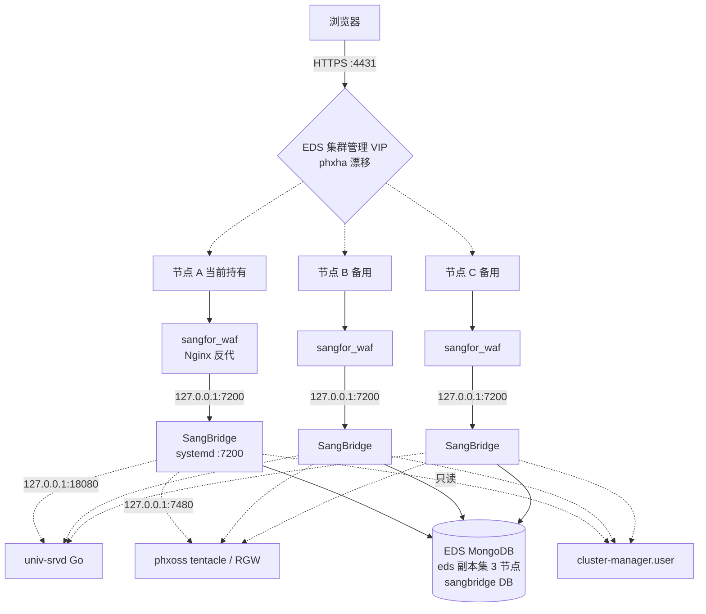
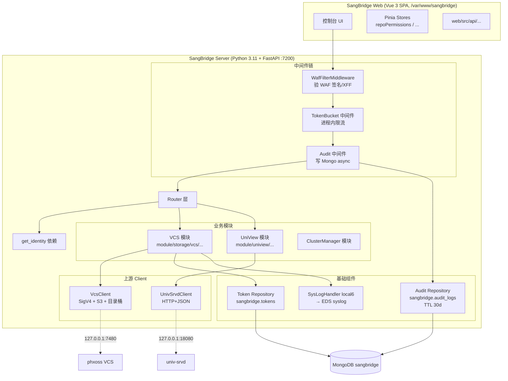
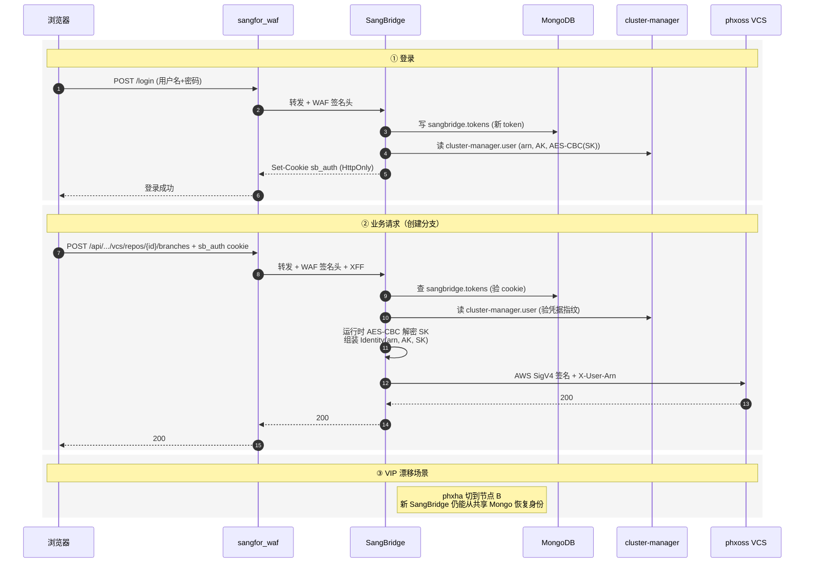

# SangBridge AI统一接入与管理控制台

> **视角**：整个项目是我的。**唯一边界**：phxoss VCS 是上游数据面（由 phxoss 团队负责）。
> **本笔记用途**：项目理解——架构、模块、机制、边界。

## 项目价值

> 视角：从"为什么存在"反推项目骨架。**价值锚点决定架构优先级**——架构图、模块设计、薄弱点都按核心价值排序，而不是反过来。这一段是整篇笔记的"第一性原则"基础。

### 核心痛点（按重要性排序）

1. **统一入口与用户体验** — 把 UniView、phxoss VCS 等分散能力收敛到同一 Web/API 入口，减少用户在多个系统间切换。
2. **身份与权限贯通** — 复用 EDS 统一用户身份：对 UniView 透传 ARN 做权限/租户隔离；对 VCS 用用户自己的 AK/SK 做 SigV4 签名，保留真实操作人。
3. **安全边界统一** — 浏览器不接触 AK/SK；所有访问经 WAF、Cookie 会话校验、IP 绑定、限流和可选审计，再调用内部上游。
4. **将上游协议复杂性从前端隔离** — 前端只调用统一 REST API；SangBridge 屏蔽 UniView 专用头、VCS/S3 SigV4、目录桶临时凭据、分片上传下载、超时和错误翻译等复杂细节。
5. **高可用下的连续访问** — 服务部署在 EDS 各节点，随 VIP 漂移切换；会话和用户状态放在共享 Mongo，用户不必因节点切换重新登录。
6. **统一运维与治理** — 统一 WAF 入口、日志、请求 ID、限流、审计和部署升级路径，使跨上游问题可追踪、可运维。

**其他维度**：SangBridge 也是 EDS 面向 AI / 数据管理能力的网关层，为后续新增上游服务提供统一接入模式。

### 关键用户与场景

**最关键用户**：EDS 平台中的**统一用户**，具体三类：

| 用户角色 | 核心职责 | 关键操作路径
|---|---|---|
| **数据管理员** | UniView catalog / 数据源 / 成员权限配置；查看迁移任务、处理预热 / 数据流转 | 登录 → UniView catalog 管理 → 数据源配置 → 任务监控 |
| **数据工程师 / 数据使用者** | 跨数据源搜索、定位数据；执行导出 / 迁移 | 登录 → UniView 搜索 → 数据定位 → 导出 / 迁移任务 |
| **数据版本管理人员** | VCS 仓库 / 分支 / 提交 / Diff / MR；对象文件上传下载 | 登录 → VCS 仓库 → 分支 / 提交 → Diff → MR → 对象管理 |

**最关键操作路径（高层）**：

```text
登录 SangBridge
  → 通过 UniView 查找/管理数据源与目录
  → 必要时创建迁移、预热或导出任务
  → 通过 VCS 管理对象数据版本、分支、提交和合并请求
```

**核心底层路径（用户价值的技术映射）**：

```text
用户登录
  → SangBridge 复核统一身份
  → 以 ARN 调 UniView、以用户 AK/SK 签名调 VCS
  → 上游按真实用户执行权限判断与审计
```

**核心用户价值不只是"提供页面"**，而是让用户能在一个统一入口中安全地完成**"找数据、管数据、迁数据、管版本"**四类操作。

### 上线前后对比

#### 上线前的痛点

- UniView、phxoss VCS 等能力入口分散，用户需在不同页面或系统间切换
- 前端或调用方需要分别适配上游协议、认证和错误，尤其 VCS 的 S3 / SigV4、上传下载、目录桶等复杂度高
- 用户身份难以一致传递：UniView 需要 ARN，VCS 需要用户 AK/SK；跨系统的权限和审计链路容易断裂
- VIP / 节点切换时，统一登录态和操作连续性需要各系统自行处理
- 网关治理能力分散：WAF、限流、请求追踪、审计策略不能在一个入口统一执行

#### 上线后可验证的改进

| 改进 | 可验证证据 |
|---|---|
| 统一入口 | `https://<集群VIP>:4431/open/api/sangbridge/v1` 可访问 UniView + VCS 功能 |
| 身份贯通 | UniView 收到 `X-IFGW-User`；VCS 请求带该用户 AK 的 SigV4 签名 |
| 凭据不暴露 | 浏览器仅有 HttpOnly `sb_auth` cookie；响应和前端存储不出现 ARN / AK / SK |
| 权限正确 | 无 ARN 的 UniView 请求被上游拒绝；无 AK/SK 的 VCS 请求返回 `VCS-CREDENTIALS-MISSING` |
| 切换连续性 | 节点 A 登录后 VIP 切到 B，同一 cookie 可继续使用（token 存于共享 Mongo） |
| 统一安全治理 | 请求必须经 WAF；伪造 / 缺失 WAF 签名转发头被拒；限流超限返回 `rate_limited` |
| 可追踪性 | 每个请求带 `X-Request-Id`，可在 SangBridge 与 WAF 日志按 ID 关联排查 |
| 上游复杂性屏蔽 | 前端仅调 SangBridge REST；SigV4、目录桶 Session、Multipart 等由后端完成 |

**注意**：持久化接口审计当前默认 `audit.enabled=false`。若把"审计日志已落库"作为上线收益，应先在生产启用 `audit.enabled=true` 并验收 Mongo `audit_logs` 写入。

### 失败成本

**完全失去**：

- SangBridge Web 页面 + `/open/api/sangbridge/v1/*` API 入口
- UniView 能力（数据目录 / 数据源 / 搜索 / 迁移 / 预热 / 导出 / 搜索模板）
- VCS 能力（仓库 / 分支 / 提交 / 标签 / Diff / MR / 对象文件上传下载）
- SangBridge 统一登录态、身份透传、网关安全治理能力

**不失去**：

- EDS 核心存储、集群管理、对象存储数据本身
- phxoss VCS、univ-srvd 上游服务本身（独立服务，仍运行；只是用户无法通过 SangBridge 正式入口访问）
- 已存数据和 Mongo 中已有 token / 审计记录

**本质**：**"AI 数据管理与数据版本管理入口不可用"**，而不是整个 EDS 存储集群不可用。若上游提供其他受支持入口，管理员理论上可绕过 SangBridge 访问，但会失去 SangBridge 提供的统一身份映射、浏览器侧凭据保护和标准操作体验。

### 价值驱动的优先级

从核心痛点反推各模块 / 机制的优先级（后续架构图和薄弱点按此重排）：

| 价值层 | 对应模块 / 机制 | 优先级 |
|---|---|---|
| 统一入口 | `## 架构设计` 中的部署架构 + 模块图；Router 层 | **P0** |
| 身份贯通 | 登录 + Token 存储 + get_identity + Identity 注入 | **P0** |
| 凭据不暴露 | AES-CBC 加密 + 运行时解密 + Cookie HttpOnly | **P0** |
| 上游协议隔离 | VcsClient（SigV4、目录桶 Session）+ UnivSrvdClient（X-IFGW-User 头） | **P0** |
| 高可用连续访问 | 进程内 stateless + 共享 Mongo 恢复身份 | **P0** |
| 统一安全治理 | WAF（外层）+ WafFilterMiddleware（内层）+ TokenBucket + Audit（**默认关闭**是 P1 风险） | **P0**（治理） / P1（审计启用） |
| 可追踪性 | SysLogHandler → EDS syslog；X-Request-Id 关联 | **P1** |
| 快速接入新上游 | 上下游分层 + Client 抽象（已支持 UniView / VCS） | **P2** |

后续 **## 核心模块设计**、**## 网关机制** 段落的展开顺序也按此表。

---


## 项目定位

SangBridge 面向 EDS 5.3.2，以 Vue 3 控制台和 Python 3.11/FastAPI 网关统一接入 VCS、UniView 等 AI 与基础设施上游服务：

```text
用户 -> SangBridge Web / FastAPI 网关 -> phxoss VCS、UniView 等上游服务
```

系统负责统一界面、登录身份、上游请求转发、错误转换、审计、限流和部署测试等能力。本人已核验的主要贡献聚焦 **VCS 管控面**：权限治理与游标分页正确性；登录、Token、WAF、审计、SigV4/S3 Express 和底层 phxoss/univ-srvd 实现不计入个人成果。


## 架构设计

> 视角：整个项目是我的。从全局视角梳理 SangBridge 的部署、模块、数据流。这部分用于建立**架构骨架**，具体模块细节在后续"## 核心模块设计"/"## 网关机制"段落中深挖。

> 视角：整个项目是我的。从全局视角梳理 SangBridge 的部署、模块、数据流。这部分用于建立**架构骨架**，具体模块细节在后续"## 核心代码"/"## 调试记录"等段落中深挖。

### 部署架构
**核心路径**（粗实线/红色节点）：用户 → VIP → 当前持有节点 WAF → SangBridge → VcsClient → phxoss VCS
**辅助路径**（细线/普通色）：SangBridge → UnivSrvdClient → univ-srvd；SangBridge → Mongo / cluster-manager
**说明**：粗实线/红节点 = 核心价值路径（高可用连续访问 + 凭据不暴露 + 身份贯通 + 上游协议隔离）；细线 = 辅助路径（UniView 能力、统一运维）




**部署关键设计权衡**：

| 维度 | 现状 | 设计意图 |
|---|---|---|
| 部署形态 | 宿主机 RPM + systemd（后端 Wheel 装在 Python 3.11 site-packages） | 跟 EDS 节点同生命周期，5.3.2 起已不再用 chroot |
| HA 方式 | phxha 漂移 VIP | 被动热备，**非**主动-主动负载均衡；正常时一个 VIP 对应一个承载节点 |
| 流量入口 | sangfor_waf（Nginx，仓库外） | TLS + WAF 规则 + 反代 + 静态资源；WAF 配置由 EDS 基础设施维护 |
| 端口暴露 | SangBridge 仅监听 127.0.0.1:7200 | 实际入口和安全边界都是 WAF；外部不能直连 SangBridge |
| 集群规模 | 随 EDS 节点数 | 无 SangBridge 专属固定副本数或自动扩缩容 |
| 重配置机制 | cluster-manager 遍历 hosts → `systemctl restart sangbridge.service` | 节点加/减时自动同步 |
| 跨节点用户体验 | "节点 A 登录 → VIP 切到 B → 同 token 继续可用" | session 不存本机，依赖共享 Mongo 恢复身份 |

### 模块拆分
**核心模块**（粗实线/红色）：VCS 模块（含 VcsClient）
**辅助模块**（细线/普通色）：UniView 模块（含 UnivSrvdClient）、ClusterManager 模块
**说明**：粗实线/红节点 = 直接服务核心价值"统一入口 + 身份贯通 + 上游协议隔离"的主路径模块；细线 = 价值衍生模块（管理面、扩展能力）




**模块关键点**：

- **每个上游一个专用 client**（不是统一泛化 client）—— 协议和认证差异太大（VCS 要 SigV4/S3，UniView 只要 JSON 头）
- 中间件链是**洋葱结构**：`WafFilter → RateLimit → Audit → Router`
- **限流/审计/并发 limiter 都是进程内的**——不跨节点共享（关键设计权衡）
- 前端 Pinia Store 做权限缓存（按 `repoId`），仓库切换重新加载

### 关键数据流：登录 → 调 VCS
**核心路径**（实线）：登录 → SangBridge 身份复核 → 调 VCS（带 SigV4）
**辅助路径**（虚线）：调 UniView（X-IFGW-User 头）—— 跟 VCS 链路相似但认证机制不同
**说明**：实线 = 价值驱动优先级 P0 路径（凭据不暴露 + 身份贯通 + 高可用连续访问）；虚线 = 价值衍生路径（管理面能力）




**身份传递关键点**：

- 浏览器只拿 `sb_auth` HttpOnly cookie，**永远不接触** ARN/AK/SK
- 每次请求 SangBridge 从 Mongo `sangbridge.tokens` 查 cookie
- 再回查 `cluster-manager.user` 验凭据指纹（密码/AK/SK 轮换**立即生效**）
- 运行时 AES-CBC 解密 SK → 内存中的 Identity(arn, AK, SK)
- 调 VCS 用 **AWS SigV4**（service=s3）+ 审计关联头 `X-User-Arn: <plain ARN>`
- 调 UniView 用 `X-IFGW-User: base64(JSON({user_arn, is_admin}))`（**不**是 X-User-Arn 旧协议）
- 调 VCS 时若用户无 AK/SK → 返回 `VCS-CREDENTIALS-MISSING`，**不降级**为服务账号

### 关键中间件与外部依赖

| 类别 | 实现 | 备注 |
|---|---|---|
| 数据库 | MongoDB（EDS 副本集 3 节点） | sangbridge 库存 `tokens` + `audit_logs`；只读 `cluster-manager.user` |
| 缓存 | **无** | 进程内限流、目录桶凭据缓存都是单机 |
| 消息队列 | **无** | 审计是进程内异步写 Mongo |
| 日志 | Python `logging` → `SysLogHandler(local6)` → EDS syslog | 落盘 `/sf/log/today/sangbridge.log` |
| 监控 | **无** Prometheus / Grafana 接入 | 故障定位纯靠日志 |
| WAF | `sangfor_waf`（Nginx，仓库外） | TLS + WAF 规则 + 反代；WAF 配置在 EDS 基础设施 |
| 应用内 WAF 防御 | `WafFilterMiddleware` | 验证 `Y-Forwarded-For`/`Y-HMAC-For`，只信任受信代理发来的 XFF |
| 限流 | 自研 FastAPI 中间件 + 进程内 Token Bucket | 用户桶 300 容量/秒补 10；IP 桶 600 容量/秒补 20；上传端点独立大桶 |
| 审计 | 自研中间件，异步写 Mongo `audit_logs` | TTL 默认 30 天；**默认 `audit.enabled=false`** |
| 并发保护 | 进程内 VCS 上传/下载/ZIP limiter | 非分布式 |
| `/metrics` | 暂无 | 监控接入缺失点 |

### 上游服务连接

| 上游 | 默认地址 | 协议 | 认证方式 | Client |
|---|---|---|---|---|
| univ-srvd (UniView) | `127.0.0.1:18080/api/v1` | HTTP + JSON REST | `X-IFGW-User: base64(JSON)` | `UnivSrvdClient` |
| phxoss tentacle / RGW (VCS) | `127.0.0.1:7480` | HTTP；控制面 VCS REST + 数据面 S3 兼容 | **AWS SigV4** (service=s3) | `VcsClient` |
| cluster-manager | 内部 | 只读 user 表 | — | 直接 Mongo 读 |

**关键设计点**：

- 默认本机 loopback 共置，地址都通过 `upstream.*.base_url` 可覆盖
- 没有 gRPC，没有"内部 SDK 嵌入上游"——用 `httpx.AsyncClient` 连接池发真实 HTTP
- 多上游分别用专用 client，因为协议和认证差异大；配置统一在 `upstream` 模块
- UniView 各领域模块（Catalog/Search/Source/Promote）复用同一个 app 级 `UnivSrvdClient`
- `VcsClient` 同时覆盖 VCS 控制面 REST 与 S3 数据面（统一处理 SigV4、对象流式、Multipart、目录桶 Session）
- 目录桶（`--x-s3` 后缀）特殊流程：用户 IAM AK/SK 签 `GET /{bucket}?session` → 拿短期凭据 → 缓存 5 分钟 / LRU 1024 → 后续用 S3ExpressAuth 签

### 关键架构薄弱点（按价值驱动重排）

> 排序依据见 [[#价值驱动的优先级]]：**威胁核心价值 = P0，影响但非核心 = P1，演进/细节问题 = P2**。

#### P0（直接威胁核心价值）

1. **AK/SK AES-CBC 加密密钥管理** — 加密密钥在哪？谁解密？轮换策略？失守的爆炸半径需要评估。威胁**凭据不暴露 + 身份贯通**（核心 P0 价值），失守=整套 SigV4 体系崩溃。
2. **审计默认关闭** — `audit.enabled=false` 是默认生产配置；写操作无痕，安全事件无追溯依据。威胁**安全边界统一 + 失败成本（事件追溯）**。
3. **session 不存本机的性能瓶颈** — 每次请求都回查 Mongo `tokens` + `cluster-manager.user`；高并发下 Mongo 可能成瓶颈。威胁**高可用连续访问**（核心 P0 价值）。

#### P1（影响但非核心）

4. **限流不跨节点** — 进程内 Token Bucket，VIP 漂移后用户桶重新计数；攻击者通过 VIP 漂移可绕过单节点限流（用户桶 300/s × N 节点 = N×300/s）。影响**安全边界统一**。
5. **VIP 漂移时旧请求处理** — 节点切换瞬间在飞请求会失败，重试策略？用户体验？影响**高可用连续访问**。

#### P2（演进/细节问题）

6. **WAF 在仓库外** — 改 WAF 配置（签名密钥、超时、规则）会绕过 SangBridge CI，需要独立变更流程。
7. **没 Redis** — 所有"分布式"功能（限流、缓存、幂等、防重）都缺基础组件，影响**快速接入新上游**。
8. **没 Prometheus** — 故障时无指标可查；纯靠 `/sf/log/today/sangbridge.log` 定位。影响**统一运维与治理**。
9. **S3 Express Session 缓存** — 5 分钟 LRU 1024 桶，过期边界、凭据轮换兼容性、与目录桶快速删除的兼容性都需要验证。
10. **CI/CD 流程不清晰** — 笔记里提"CI 镜像"但没流程；后端 RPM 构建、前端 build、EDS 节点部署的链路需要梳理。


### 事实边界更新（按"整个项目是我的"视角）

> 原"## 事实边界"段落是 **VCS 视角**的事实边界（哪些工作是我的）。从"整个项目"视角看，那些边界变成了"需要深入理解的模块"。本节列出**架构层面**的事实边界。

| 旧笔记内容 | 实际情况 | 备注 |
|---|---|---|
| `X-User-Arn: <plain ARN>` 用于 UniView | **旧协议已废弃**；当前用 `X-IFGW-User` (Base64 JSON) | VCS 仍用 `X-User-Arn`（审计关联头，不是授权主体） |
| "登录 Token WAF 审计 SigV4/S3 Express 不计入个人成果" | 从"整个项目是我的"视角，这些**都是 SangBridge 的一部分**，要全部搞懂 | 之前是 VCS 视角的边界；新视角下边界变成"需要深入理解的模块" |
| 默认生产 `audit.enabled=false` | 笔记没提——**审计默认关闭** | 架构薄弱点 #2 |
| WAF 在仓库外 | 笔记没提 | 架构薄弱点 #3 |
| 限流不跨节点 | 笔记没提——进程内 Token Bucket | 架构薄弱点 #1 |
| 没 Redis / 消息队列 / Prometheus | 笔记没提 | 架构薄弱点 #6 #7 |
| 凭据解密 / AES-CBC 密钥管理 | 完全空白 | 架构薄弱点 #5 |
| CI/CD 流程 | 笔记里提"CI 镜像"但没流程 | 架构薄弱点 #10 |

## 核心模块设计

> 视角：从整个项目设计意图出发，讲清每个模块"是什么 / 为什么这样设计 / 关键设计点"。

### VCS 模块

VCS 模块是 SangBridge 管控面最核心的模块之一，对接 phxoss 数据面（边界外），提供仓库、分支、标签、提交、MR、S3 对象存储的访问能力。

#### 核心职责

- **VCS 控制面 REST**：仓库、分支、标签、提交、MR、对比的 VCS REST 调用（按 `phxoss /vcs/v1/*` 接口）
- **数据面 S3 兼容**：对象上传下载、Multipart、目录桶 Session（通过 phxoss tentacle / RGW，S3 兼容 API）
- **权限治理子模块**：消费上游 `/permissions` 权限集合，做"按钮能力 → 请求前校验 → 上游最终授权"的分层
- **游标分页子模块**：统一 `truncated/after`、opaque cursor、S3 continuation token 的消费语义

#### 权限治理子模块（核心机制）

**设计目标**：让控制台状态与数据面策略一致，提前阻止误操作和无效请求；安全边界仍是 phxoss Bucket Policy。

**完整调用链**：

```text
ResourceDetail(route.params.id)
  → repoPermissionsStore.load(repoId)
  → repoApi.permissions(repoId)
  → GET /api/sangbridge/v1/vcs/repos/{repoId}/permissions
  → RepoMgr / VcsClient
  → GET phxoss /vcs/v1/repos/{repoId}/permissions
  → Action、Button、Method+URL 权限集合
  → useRepoPermissions 生成 canCreate/canDelete/canGetDiff 等能力
  → 按钮置灰 + 部分 Handler 请求前拦截
  → SangBridge 转发用户身份，phxoss Bucket Policy 最终授权
```

**关键设计点**：

- SangBridge VCS Router 用 `Depends(get_identity)` 取得登录身份，以 `X-User-Arn` 与 SigV4 签名向 phxoss 转发
- phxoss 权限响应含 `bucket_name`、`user`、`is_owner`、`apis[]`；前端按 IAM Action / Button 标识 / Method+URL 三种方式匹配
- 权限数据按 `repoId` 缓存，仓库切换会重新加载
- **权限四类条件**共同决定：上游权限集合 + 当前仓库角色 + 资源创建人归属 + 页面业务条件
  - `admin`：可操作任意创建人资源
  - `developer`：只能操作 `creator_id == 当前用户名` 的资源
  - `visitor`：不允许写操作；角色未加载时按不可操作处理
  - 业务条件：默认分支不可删、源/目标必须都是分支、源分支归属不明确禁提 MR

**前端涉及页面**：`BranchTab.vue`、`TagTab.vue`、`CommitTab.vue`、`CompareTab.vue`、`NewPRModal.vue`、`PRApprovalModal.vue`

**前端关键代码路径**：

- `web/src/views/vcs/ResourceDetail.vue`
- `web/src/stores/repoPermissions.ts`
- `web/src/composables/useRepoPermissions.ts`
- `web/src/api/vcs/index.ts`

**后端关键代码路径**：

- `server/sangbridge_server/module/storage/vcs/repo/web_api/router.py`
- `server/sangbridge_server/module/storage/vcs/repo/manager/repo_mgr.py`
- `server/sangbridge_server/client/phxoss/vcs/vcs_client.py`

#### 游标分页子模块（核心机制）

**设计目标**：以后端 `truncated/after` 为唯一可信源，前端不臆测下一页；不同分页语义（普通 after、opaque cursor、S3 continuation token）需要清晰区分。

**核心契约**：

- **普通 cursor**（仓库/分支/标签列表）：`truncated: bool` + `after: str` —— 前端用 `after` 当下一次请求参数
- **opaque cursor**（提交图/树形结构）：后端返回 base64 编码的不透明 cursor，前端**不能**解析
- **S3 continuation token**（快照文件树）：从 S3 ListObjectsV2 返回的 `NextContinuationToken`，不能混淆为普通 cursor

**关键修复点**（机制层面）：

- **exact-page 假下一页**：之前前端用 "current + 1" 推算下一页，遇到 truncated=true 但 `after` 不前进时就翻错。修复：以后端返回的 `after` 为准
- **S3 快照 token 错用**：之前用普通 `after` 当 S3 token 传给 S3 API。修复：明确区分两类 cursor
- **仓库超过 50 条无法继续**：默认 page size 设了硬上限。修复：分页契约统一到 `truncated/after`，无硬上限
- **快照漏数据**：游标构造错位导致跳页。修复：cursor 构造在 client 层封装，调用方不直接处理

**后端测试覆盖**（涉及 py 集成测试）：

- `server/tests/integration/vcs/test_branch_router.py`
- `server/tests/integration/vcs/test_tag_router.py`
- `server/tests/integration/vcs/test_commit_router.py`
- `server/tests/integration/vcs/test_workspace_router.py`
- `server/tests/unit/vcs/test_workspace_mgr.py`
- `server/tests/unit/client/test_vcs_client_coverage.py`

**已知薄弱点**：仓库 Router `GET /repos?limit=&after=` 集成测试；后端 exact-page 契约；空页但 `truncated=true`、`after` 不前进等异常契约；三页以上翻页和回退；仓库切换后的旧请求覆盖；搜索与翻页并发；S3 token 失效/变化；以及上游重叠数据的去重策略。

#### AK/SK 加密管理（已深入理解，P0 薄弱点 #1）

> 详见 [[#关键架构薄弱点]] #1。这部分把"为什么是 P0"展开成具体机制 + 风险 + 应急链路。

**密钥存储链路**：

```text
/sf/etc/eds_secrets.yml  (encryption.aes_cbc_key: <16-byte AES-128>)
  → /usr/bin/phxcp_runtime get encryption.aes_cbc_key
  → /sf/bin/sangbridge_env_wrapper.sh
  → export SANGBRIDGE_EDS_AES_CBC_KEY=<key>
  → exec /usr/local/bin/sangbridge-server
  → service 启动期读取环境变量
  → load_runtime_secrets() 强制校验 16 字节 ASCII
  → AuthProvider 解密 cluster-manager.user.keys[*].secret_key
```

**关键事实**：

- 密钥通过 systemd 的 wrapper 注入到进程环境变量，**不写入** `/etc/sangbridge/config.yml`、数据库或应用日志
- 启动时强制 16 字节校验，缺失/长度不对**直接启动失败**
- SK **不是**启动时一次性解密，而是**每次受保护请求都动态解密**——登录只计算 user.keys 指纹
- 解密后的 SK 只存在当前请求的进程内存，**不写回** `sangbridge.tokens`
- AES key 缺失或解密失败 → Identity 中 AK/SK 为空 → VCS 返回 `VCS-CREDENTIALS-MISSING`

**轮换策略**：

- **不定期轮换**——被动检测 + 立即使旧登录态失效
- 触发：外部修改 `user.keys[]` → SangBridge 下次请求立即发现
- 范围：单个 `cluster-manager.user.keys[]` 为单位
- 轮换后该用户 `sb_auth` token 被删除，响应 `401 auth_credentials_rotated`，必须重新登录
- **没有双凭据平滑期**——SangBridge 不实现"旧、新凭据同时被同一登录态接受"
- **安全轮换操作顺序**（强制重新登录换取安全）：
  1. 在 RGW / cluster-manager 侧创建新 AK/SK
  2. 更新该用户的 `keys[]`，确保新 key 是 SangBridge 将优先选取的第一把有效 key
  3. 预期该用户所有 SangBridge 会话被强制重新登录
  4. 确认新登录后的 VCS 操作成功
  5. 再撤销旧 key
- **不混为一谈**：平台 `phxcp_runtime rekey` 轮换的是本机 runtime 配置文件的保护密钥（AES-256-GCM），**不会**自动改变 `encryption.aes_cbc_key` 明文值，**也不会**重加密 Mongo 里的 `user.keys[].secret_key`

**失守的爆炸半径**：

- 一个节点 root 失守 = **高概率"全体用户 SK 的解密能力泄漏"**（不是只影响该节点）
  - 原因：`cluster-manager.user` 在集群共享 Mongo；任意接管 VIP 的 SangBridge / cluster-manager 节点必须能解同一批 `keys[]`
  - `/sf/etc/phxcp_runtime.key` 每节点不同，但 `encryption.aes_cbc_key` 必须是集群内一致（否则各节点解不出同一份共享数据）
- **检测能力不足**（应假设无告警下已失守）：
  - 没有密钥访问审计 / FIM、HSM / KMS 取钥审计、`phxcp_runtime get` 异常告警、SIEM / EDR 联动
  - 现有可观测性（请求日志、进程存活、IP 不匹配、`user.keys` 变更、签名请求审计）只能发现异常使用，**不能可靠发现"攻击者已复制 AES key"**
  - **应将节点 root 失守视作高优先级安全事件**，不能等 SangBridge 自己报警
- 现有 rekey ≠ 轮换用户 SK 解密 key——仅 `phxcp_runtime rekey` 不足以止血

**应急链路（仓库无完整 runbook，需平台/运维/对象存储团队协同）**：

1. 发现/确认节点失守
2. 隔离受侵节点、摘除 VIP / 停止相关服务、保全证据
3. 评估 Mongo 与运行时密钥是否也已暴露
4. 轮换受影响用户的 RGW AK/SK，并撤销旧 AK/SK
5. 生成新的 `encryption.aes_cbc_key`
6. 使用旧 key 解密、使用新 key 重加密所有受影响的 `user.keys[].secret_key`
7. 将新的运行时配置安全分发到各节点
8. 各节点执行 `runtime rekey`，重启 cluster-manager / SangBridge 等依赖方
9. 吊销 SangBridge token、验证新登录与 VCS SigV4
10. 复盘并监控旧 AK/SK 是否还有使用痕迹

**应急处置对旧 sb_auth cookie 的影响**：

| 处置动作 | 旧 sb_auth cookie 是否仍可用 |
|---|---|
| 仅重启 SangBridge / VIP 漂移 | ✓ 可继续使用（token 在共享 Mongo） |
| 只执行 runtime rekey，业务 CBC key 不变 | ✓ 通常可继续使用；但**不足以应对** AES-CBC key 已泄漏 |
| 修改任一用户 `keys[]` | ✗ 该用户下次请求即 `401 auth_credentials_rotated`，必须重登 |
| 全员重发 AK/SK 或全量重加密后 `keys[]` 改变 | ✗ 所有活跃用户会被迫重新登录 |
| 主动删除/吊销 `sangbridge.tokens` | ✗ 对应 cookie 立即失效，必须重登 |

**关键洞察**：在完成上游 RGW 旧 AK/SK 撤销前，**攻击者已复制的旧 AK/SK 仍可能直接对 phxoss 有效**；SangBridge token 失效本身**不能撤销被盗的底层对象存储凭据**。

**遗留薄弱点**（已识别但当前未实现）：

- 仓库无完整自动化的"一键全局 AES-CBC key 轮换" runbook 或演练记录
- 关键路径（"批量重加密 Mongo 用户 SK、分发新 CBC key、全局 token 吊销"）在当前仓库里没看到完整自动化
- 节点 root 失守无直接检测能力（应假设无告警下已经失守，需主动监控 + 演练）


### UniView 模块

> **状态**：待补全——目前掌握信息有限（只通过 UnivSrvdClient 接入）。需要后续梳理：

- 内部领域模块（Catalog / Search / Source / Promote）的具体职责
- 与 VCS 模块的差异（身份头 vs SigV4）
- 数据流转：SangBridge 业务操作 → UnivSrvdClient → univ-srvd 各领域服务

### ClusterManager 模块

> **状态**：待补全——目前只通过只读 user 表接入。需要后续梳理：

- sangbridge 对 cluster-manager 的接口范围
- EDS 集群重配置逻辑
- 用户/凭据/ARN 的生命周期管理

## 网关机制

> 视角：SangBridge 作为 FastAPI 网关，对外统一控制台流量入口，对内转发到上游服务。这一节讲清 SangBridge 网关的核心机制设计。
### 高可用与 VIP 漂移（P1 薄弱点 #5，已深入理解）

> 详见 [[#关键架构薄弱点]] #5。这部分把"为什么是 P1"展开成 VIP 漂移时序、失败模式、drain 缺失、写操作语义。

**VIP 漂移的实际行为**：

- VIP 漂移**不迁移 TCP 连接状态**，也不把 A 上的 HTTP 请求搬到 B
- A 故障时已建立连接通常会失败：TCP RST / 连接超时 / 下次读写失败——取决于故障形态
- B 接管后只能接收新连接；原 TCP 四元组在 B 没有状态
- phxha 带有 gratuitous ARP、TCP tickle/rebuild，**但不等于 HTTP 请求级无损迁移**
- **客户端必须重试**；GET/幂等可透明重试；非幂等 POST 若"后端已执行、响应丢失"会出现结果不确定

**VIP 漂移的时序与时长**：

- **秒级设计**，不是毫秒级
- SangBridge 设计文档把"VIP 切换超过 3 秒"列为风险——说明预期是几秒内恢复
- EDS HA 验收脚本要求从 DCM reboot 到 grant succ 不超过 4 秒（**验收阈值，不是每次故障的实测均值**）
- 后台 flow 的最坏接管设计是 30s 心跳超时 + 10s watcher 扫描 ≈ **40s**

**网络入口恢复** vs **后台任务接管**：时间尺度不同
- 网络入口：目标/经验上数秒
- 后台任务：可达 40s
- 客户端感知：取决于客户端超时 + 重试策略

**用户感知矩阵**：

| 场景 | 用户感知 |
|---|---|
| 切换前请求已完成 | 无感 |
| 客户端空闲，下一次请求时 VIP 已恢复 | 无感 |
| 请求可安全自动重试，重试窗口覆盖切换时间 | 无感 |
| 登录 token 已落共享 Mongo，B 能继续验证同一 token | 无感 |
| 正在进行 HTTP 请求、SSE/流式下载或大文件上传 | **明显有感** |
| 浏览器/SDK 复用旧 keep-alive 连接，首次请求失败后才重连 | **明显有感** |
| 客户端不重试，或连接超时设置过长 | **明显有感** |
| 非幂等写请求响应丢失，前端需展示"结果未知"并查询任务状态 | **明显有感** |
| 后台 flow 在等待跨节点 watcher 接管 | **数十秒状态停滞** |

**失败模式 vs 客户端感知**：

- **不能承诺固定只会"连接断开"或"5xx"中的某一种**——取决于故障方式和客户端是否复用旧连接
- 硬故障时浏览器通常连接失败/连接被重置
- 网络黑洞或旧连接无响应时表现为超时
- 若请求已到达 WAF 或新节点但后端/上游不可用，才可能收到 502/503/504
- "VIP 漂移测试"验证的是新请求可回源认证，**不是真实 phxha 切换期间长连接必不中断**

**客户端超时边界**：

| 场景 | 客户端何时放弃 | SangBridge→VCS |
|---|---|---|
| 普通前端 API | 30 秒 | 60 秒 |
| VCS 长操作（merge/revert/cherry-pick/commit） | 180 秒 | 180 秒 |
| 上传分片 | 60 秒 | 60 秒 |
| 上传合并 | 300 秒 | 180 秒 |

**重要不确定窗口**：**前端 30 秒已报超时，但 SangBridge 仍可能继续等待上游直到 60 秒，并最终执行成功**——用户不能把"前端超时"视为"操作未发生"。

**客户端重试策略**：

- 前端**没有对普通 SangBridge API 做全局自动重试**——Axios 默认超时后提示用户
- **特例**：上传分片普通失败最多重试 3 次，退避 1s/2s/4s；429 限流时全局冷却 2 秒，单请求最多额外重试 10 次
- 上传策略**不是普通写操作的通用策略**

**断路器（circuit breaker）**：

- 后端调用 phxoss/UniView **没有通用断路器**，也没有"仅幂等 GET 自动重试两次"
- 连接拒绝尽快转 503 gateway_unavailable；上游超时转 504 gateway_timeout
- 但**持续故障下，每个新请求仍会尝试上游，而非打开 circuit breaker 并在本地快速拒绝**
- 现有"快速失败"主要是容量保护，**不是故障断路器**：
  - 文件传输单进程并发满或等待超过 5 秒时拒绝
  - 认证本地限流
  - 都不能避免节点切换或上游持续故障时的重复等待

**服务端 drain 策略**：

- 当前**没有"面向 HA 切换的 drain 协议"**
- 关闭行为依赖 Uvicorn 收到 SIGTERM 后的通用退出流程，**被 systemd 的 5 秒上限强约束**
- `sangbridge.service` 配置：
  - `KillSignal=SIGTERM`
  - `TimeoutStopSec=5`
  - `KillMode=mixed`
- **没有 ExecStopPre / ExecStop / 摘流 / 下线标记 / 等待 in-flight 请求归零的逻辑**
- 超过 5 秒仍未退出时，systemd 进入强制终止路径——**长于约 5 秒的 in-flight 请求不能保证完成**
- FastAPI lifespan 正常 shutdown 只关闭 Mongo/UniView/cluster-manager/VCS 连接池
- **没有 drain 队列、请求迁移、后台任务交接或持久化恢复**

**长连接与文件传输**：

- 代码中**没有 WebSocket、SSE/EventSource 端点**——不存在连接迁移、客户端重连协议或事件游标恢复
- **单文件下载**：流式 HTTP，透传 Range，支持 206/Content-Range——**协议层断点续传**；但 SangBridge 前端**没有实现统一的自动下载续传**
- **ZIP 下载**：流式生成，没有 Range——**代码和 UI 均明确不支持续传**
- **小文件上传**：流式 PUT，**中断后没有断点续传**
- **大文件 multipart 上传**：upload-init → upload-part → upload-complete，前端可对当前页面失败分片重试；同一 upload_id 下重传分片是可恢复路径——但**没有"列出已上传分片并在刷新/切换节点后恢复任务"的 SangBridge API 或持久化上传任务状态**

**主动通知 phxha"准备切换"**：**没有**——SangBridge 不参与 phxha 的选主或切换编排。

**含义**：
- 当前 HA 能保证的是**"切换后的新请求可恢复"**
- **不能保证"切换期间请求无损"**
- 180 秒的 VCS 长操作和下载/上传流，**与 TimeoutStopSec=5 存在明显冲突**
- **计划维护时应避免直接 stop 承载 VIP 的节点**，或补齐摘流、drain 状态和传输恢复机制

**用户状态连续性**：

- 旧 cookie 在切换到 B 后通常仍有效，**不需要重新登录**
- 前提：B 能连共享 Mongo / token 未过期 / 用户未禁用 / 密码和 keys[] 指纹未变 / 客户端源 IP 未变（token 有 IP 绑定）
- 不是专门的"会话迁移"：登录 token 以随机值写入共享 Mongo sangbridge.tokens，cookie 只携带该随机值；B 收到请求后重新查 token，回查 cluster-manager.user
- 没有节点内存会话、粘性会话或复制 token cache 需要迁移——**认证链路刻意不做进程缓存**
- "无缝"的准确含义：**切换完成后的新请求可继续使用原 cookie**，**而不是已经在 A 上执行的请求会无缝转到 B**

**跨节点用户感知时延组成**（仓库无 phxha 演练数据）：

1. 故障探测/选主 + VIP 漂移
2. 浏览器发现旧连接失败
3. 新建 TCP/TLS 连接
4. B 上两次 Mongo 回源认证
5. 业务处理/上游调用

主导总时延通常是 phxha 探测与 VIP 收敛；SangBridge 不包含该配置和指标。

**写操作的最终语义**（**没有 exactly-once 保证**）：

| 切换时刻 | 最终语义 |
|---|---|
| 请求尚未到 A / A 未调用上游 | 操作未发生；重发通常安全，但仍取决于具体接口 |
| A 已把请求发给 phxoss/UniView，但响应未返回客户端 | **结果未知**：上游可能已成功，客户端却看到断开或超时 |
| A 正在流式上传/下载 | 连接中断；上传可能只完成部分传输，下载需重连 |
| B 收到重发请求 | 会按该接口的上游语义再次执行，**不会识别为"这是 A 的同一请求"** |

**重试 POST/PUT 可能出现的 4 种情况**：

| 情况 | 触发条件 |
|---|---|
| **重复** | 创建 MR 等非幂等动作，若上游未以业务键去重 |
| **不重复但返回冲突** | 创建同名分支通常由 VCS 资源唯一性返回 409 |
| **丢失** | 请求在到达可持久化的上游之前就中断 |
| **部分提交/未知结果** | 流式上传、multipart complete、长 VCS 操作 |

**幂等性现状**：

- **不是全局保证**——全局 Idempotency-Key 响应缓存/回放**已被移除**
- 前端**不会**为所有 POST 自动生成幂等键，后端**也没有**统一去重集合
- 唯一明确接近幂等的业务例外：**"通过 MR 回退"**支持透传 X-Idempotency-Key，并处理上游 VCS-IDEMPOTENT-REPLAY 返回原成功结果
- 其他写接口**不能假设安全重试**
- **正确恢复模式**：超时后先查询目标资源或操作状态，再决定是否重发；对高价值写操作应补充业务级 idempotency key 和可查询的操作状态

**遗留薄弱点**（已识别但当前未实现）：

- **无 drain 协议**——systemd TimeoutStopSec=5 与 180 秒 VCS 长操作直接冲突
- **无 WebSocket/SSE 端点**——但 UI/前端可能有基于轮询的"准实时"，不算真正的长连接
- **ZIP 下载/小文件上传无断点续传**——明确不支持续传
- **大文件 multipart 上传**没有"列出已上传分片"的持久化 API——客户端丢失 upload_id 后只能重新初始化
- **无全局 Idempotency-Key 中间件**——已被移除；写操作重试安全依赖上游业务级约束
- **无通用 circuit breaker**——上游故障持续时每个请求都尝试，无法快速失败
- **SangBridge 不参与 phxha 切换编排**——没有主动通知"准备切换"、摘流、下线标记
- **无 phxha 演练数据**——仓库没有真实 P50/P95 切换时延
- **计划维护流程不明确**——避免直接 stop 承载 VIP 节点应该是隐性约定，没有 playbook
- **写操作结果未知的处理**——前端"前端超时≠操作未发生"的认知没有通用提示
- **流式上传的进度恢复**——没有 upload_id 持久化 + 断点查询 API
- **写操作服务端超时边界**（30 秒前端 vs 60 秒 SangBridge vs 180 秒 VCS）没有统一文档化


### 中间件链（洋葱结构）

请求按以下顺序穿过中间件：

```text
HTTP 请求
  → WafFilterMiddleware（验 WAF 签名/XFF）
  → TokenBucket 中间件（进程内限流）
  → Audit 中间件（写操作异步写 Mongo audit_logs）
  → Router 层（业务处理）
```

### 身份与转发

- `Depends(get_identity)` 注入登录身份（从 `sb_auth` cookie → sangbridge.tokens → cluster-manager.user）
- 上游转发用各 client 自己的认证机制：
  - VCS：AWS SigV4（service=s3），运行时 AES-CBC 解密 SK
  - UniView：`X-IFGW-User: base64(JSON({user_arn, is_admin}))`
  - ClusterManager：只读 Mongo，无认证转换
- 凭据轮换**立即生效**（每次请求都回查 user 表验指纹）

#### 身份与转发的 Mongo 查询性能（P0 薄弱点 #3，已深入理解）

> 详见 [[#关键架构薄弱点]] #3。这部分把"为什么是 P0"展开成实际查询形态、性能瓶颈的真实位置、缓存取舍、替代方案设计。

**正常受保护请求的 Mongo 查询 = 2 次读**（**不**用 token/user 进程内缓存）：

1. `sangbridge.tokens` 按 `sb_auth` 查 token：
   ```javascript
   db.tokens.findOne({ token: "<sb_auth cookie 原文>" })
   ```
2. `cluster-manager.user` 一次 `$or` findOne（**不是多次 round-trip**）：
   ```javascript
   db.user.findOne({
     $or: [
       { _id: "<user_id 字符串>" },
       { username: "<user_id>" },
       { userid: "<user_id>" },
       { console_email: "<user_id>" },
       { _id: ObjectId("<user_id>") }  // user_id 可解析时才加入
     ]
   })
   ```

第 2 次读**一次性**完成：用户存在性、status/disabled 校验、user.keys 指纹、密码指纹、读取解密 AK/SK、unified_view_enabled 等。

**各场景的查询次数**：

| 场景 | Mongo 操作 |
|---|---|
| 有效受保护请求 | 2 次读 |
| 缺少 cookie | 0 次 |
| 无效 token | 1 次读 |
| token 已过期 | 1 次读 + 1 次删除 token |
| 用户被禁用/删除 | 2 次读 + 1 次删除 token |
| 用户 keys 已轮换 | 2 次读 + 1 次异步删除 token |
| 密码指纹变化 | 2 次读 + 1 次删除 token |
| 开启通用审计的写请求 | 上述 + 异步 `insertOne(audit_logs)` |

**额外条件查询**：UniView/VCS 路由功能开关检查，每进程 10 秒 TTL 缓存（**命中时为 0**）。

**FastAPI 同请求复用**：`get_identity` 在 Router + feature gate 间默认复用——不会做两轮认证查询。

**性能瓶颈的真实位置**（仓库可确认的）：

| 位置 | 结论 |
|---|---|
| Mongo primary CPU/IO | 可能成为瓶颈，**但无生产指标证明** |
| Mongo 网络 RTT | 每个请求至少 2 次逻辑读，**网络 RTT 直接叠加**到认证路径 |
| Mongo 连接池 | 每进程 1 个 AsyncMongoClient 单例，**未显式配置 `maxPoolSize`**，实际并发上限依赖 PyMongo 默认值 |
| user 查询 | 用 `$or` findOne（不是多次 round-trip），**但仓库未提供索引/执行计划证据** |
| 上游 UniView/phxoss | **更可能主导端到端延迟**——SangBridge 的 Mongo 认证只是固定前置成本 |
| 审计写 | 默认关闭；启用后增加 majority journal 写和索引维护压力 |

**Mongo 架构与读写位置**：

- EDS Mongo 是 `replSet=eds` 副本集，标准部署 3 个成员
- SangBridge 连接串来自 `/sf/config/cluster.json`
- **代码未配 `readPreference=secondary/secondaryPreferred`——默认读走 primary**
- 写：`w=majority`, `journal=true`（多数派确认）
- 结论：高并发下，**认证读集中到 primary**，而不是由多个 secondary 分摊

**Mongo 慢/不可用时的实际行为**：

| 场景 | 当前行为 |
|---|---|
| 启动期 Mongo 不可达 | 启动 ping/连接失败重试，耗尽后进程退出，**systemd 重启** |
| `tokens.findOne` 慢/失败 | 没有 Mongo 专用 503，走通用异常处理 |
| `user.findOne` 慢/失败 | 记录 warning，**跳过本轮用户复核**，Identity 不含当前 AK/SK |
| Mongo 慢但未达驱动超时 | 请求会等待 Mongo |
| 访问 VCS 时 user 查询失败 | 拿不到 AK/SK → 返回 `VCS-CREDENTIALS-MISSING` |
| 访问 UniView 时 user 查询失败 | 拿不到 `unified_view_enabled` 可能被拒绝 |
| 审计写慢/失败 | 最多等 2 秒后丢弃，主业务不阻塞 |

**驱动层关键超时配置**：

```yaml
serverSelectionTimeoutMS: 15s
connectTimeoutMS: 3s
socketTimeoutMS: 120s
wTimeoutMS: 30s
w: majority
journal: true
```

**关键观察**：**最差表现不是快速返回 503**，而是等待较长 Mongo socket/选主超时后再失败——用户体验是"卡很久"而不是"立即降级"。

**无法从仓库回答的数据**（需要从生产 Prometheus/Mongo 状态采集）：

- 受保护请求平均/P95/P99 耗时
- 两次 Mongo 读分别占多少毫秒、占端到端比例
- primary CPU、磁盘、网络、连接池等待
- secondary 复制延迟
- 单 Mongo 节点可承受的 QPS
- SangBridge 实际 QPS 和峰值并发
- `cluster-manager.user` 实际文档数、平均文档大小、索引大小
- 用户量级（千/万/十万）

**缓存策略的取舍**：

**当前"完全无缓存"是明确的安全设计，不是单纯技术受限**：

- 每次受保护请求都回源查 tokens 和 cluster-manager.user
- 用户禁用、登出/吊销、密码修改、keys[] 轮换、IP 绑定变化**下一次请求立即生效**
- 实现和验收测试都明确**禁止进程内 token cache**

**30 秒内存缓存技术上可行，但会改变该语义**：

- 命中时 Mongo 读从 2 次降到 0 次（缓存完整 identity）
- 受保护流量 R QPS、缓存命中率 h → 理论减少 `2 × R × h` 次 Mongo 读/秒
- 仓库**没有实际 QPS、命中率、Mongo 耗时数据**——不能给出具体收益
- 代价：旧会话最多还能用 30 秒（安全窗口）

**缓存 + 轮换的两种取舍**：

1. **接受"30 秒内生效"**：TTL 到期后重新校验。简单，但安全承诺从"下一请求生效"改为"最多 30 秒生效"
2. **保持近似立即生效**：用单调递增的 `auth_revision` 字段 + 失效事件广播（Redis Pub/Sub / Stream）——考虑消息丢失、节点重连、重放、缓存兜底 TTL

**尤其不应把解密后的 SK 当作普通身份缓存长期保存**——身份状态缓存与 AK/SK 使用应分开设计，最小化明文凭据在进程内的驻留时间。

**"轮换立即生效"是否过度设计？**

- **没有数据可下结论**：仓库里没有真实用户轮换频率、泄露事件、Mongo 压力统计
- 该链路最终会取用户 AK/SK 做用户级 SigV4 上游访问，并且 VIP 漂移后无缓存可避免节点不一致——"立即生效"对场景**并非无意义**
- **但是否值得为它承担每请求 2 次 Mongo 读，应先采集实际数据再选择 SLA**

**仓库现状**：

- 没有 Redis 依赖、配置、ADR——**不能说历史上被否决**
- 现有两类范围较小的缓存：功能开关 10 秒 TTL 进程内、VCS 目录桶临时 session 5 分钟
- 两者都**不承载用户认证/撤销状态**

**替代方案的设计**：

**JWT-like 客户端签名 Token**：

- 纯 JWT 只验签：SangBridge 可不查 tokens 集合，但登出/封禁/密码改/keys 轮换后，**已签发 JWT 一直有效到过期**
- 要支持立即撤销，仍需查共享状态（`user.auth_revision` / JWT jti 黑名单 / 撤销时间）——又回到每请求至少 1 次 Mongo/Redis 查
- 折中：短 JWT（5 分钟）+ 可选撤销列表，把"立即生效"改"最长 5 分钟"
- **结论**：JWT 适合降低 token 存储与跨服务验签成本，不天然适合 SangBridge 当前"下一请求失效"的凭据安全语义

**各缓存方案对比**：

| 方案 | 命中时 Mongo 读 | 一致性窗口 | 核心问题 |
|---|---|---|---|
| 本地仅缓存 token | 1 次 | token 吊销/登出最多 TTL | 用户禁用/轮换仍可实时发现 |
| 本地仅缓存用户状态 | 1 次 | 禁用/密码/key 轮换最多 TTL | token 吊销仍实时；用户安全状态可能陈旧 |
| **本地缓存完整 identity** | **0 次** | 所有撤销事件最多 TTL | 30 秒内旧会话/旧 keys 状态可能有效 |
| Redis 共享完整 identity | 0 次 Mongo，通常 1-2 次 Redis | 取决于失效广播 | Redis 故障、广播丢失、凭据保护新问题 |
| JWT + 每请求 revision/status 校验 | 通常 1 次 | 可做到近实时 | 省 token 查询，不省用户安全状态查询 |

**Mongo 读走 secondary 不建议用于当前认证判定**：

- 刚禁用用户/吊销 token/轮换 keys 后，**secondary 可能尚未复制**，旧凭据继续被接受
- 新 token 也可能暂时"查不到"
- `majority` 写确认**不能自动**让普通 secondary 读具备"读己之写/最新读"语义
- 强行用 causal session、afterClusterTime 等机制，复杂度和尾延迟会增加
- 现有实现未设 readPreference，**默认 primary 符合强一致校验意图**

**作者设计的渐进路径（从最便宜到最贵）**：

1. **保持现状语义，先做 Mongo 优化（最便宜）**
   - 保持每请求 2 次回源
   - **验证 token 精确索引、用户身份查询索引、连接池、Mongo P95 和主库容量**
   - 收益：不引入任何撤销窗口、不改安全模型
   - 代价：读压仍与请求量线性增长
2. **本地 LRU，TTL 5-30 秒（低成本、明确降级）**
   - 缓存完整身份，过期回源；或只缓存 token，以较小风险换一半查询削减
   - 收益：高命中时减少 50%-100% Mongo 读、实现快
   - 代价：必须正式接受并记录最长 TTL 的封禁/轮换延迟；多节点缓存不一致
   - 适合 Mongo 已成为证实的瓶颈、且业务能接受"≤30 秒撤销"的情况
3. **本地 LRU + Redis 版本化失效（较贵，兼顾性能和近实时）**
   - 用户记录维护 `auth_revision`
   - 轮换 key/改密码/禁用/登出时，事务性更新版本/撤销记录
   - 通过 Redis Stream/PubSub 广播
   - 每个节点立即删除用户及 token 的本地缓存
   - 设置较短 TTL 作为漏消息兜底
   - 收益：通常命中本地、Mongo 读接近零，撤销窗口压到事件传播时间
   - 代价：新增 Redis 高可用、消息可靠投递/重放/乱序处理、监控告警和故障降级
   - **不能承诺数学意义的"绝对零窗口"**，除非关键请求再同步校验版本

**核心结论**：**不要为了"去掉 Mongo"直接换 JWT 或 secondary 读**。先量化 Mongo 是否真是瓶颈；若要缓存，**先明确撤销 SLA**。当前实现最保守 SLA：用户状态或凭据一变，下一请求即重新判定。

**遗留薄弱点**（已识别但当前未实现）：

- **无生产压测数据**——具体 QPS、P95、Mongo 容量、用户量级、文档数全部未知
- **token 查询索引和 user 查询的 `$or` 索引未提供执行计划证据**——慢查询风险未量化
- **连接池 `maxPoolSize` 未显式配置**——并发上限依赖 PyMongo 默认值
- **无 Mongo 熔断器或降级缓存**——慢/不可用时表现为"卡很久"而非"快速 503"
- **驱动层超时较大**（serverSelectionTimeoutMS=15s, socketTimeoutMS=120s）——单次失败可能拖很久
- **审计写默认关闭**——启用后会增加 majority journal 写和索引维护压力，与认证读叠加在 primary 上
- **缓存路线全靠预期收益**——没有实测数据支撑任何方案的"省钱"程度
- **撤销 SLA 未明确文档化**——目前"下一请求失效"是隐式承诺，但若改缓存方案必须显式重写为"≤30 秒生效"或"≤5 分钟生效"
- **JWT 路线风险**：当前"下一请求失效"语义无法用纯 JWT 还原，除非引入额外状态查询——但这又回到 Mongo/Redis 查询


### 限流

- **自研 FastAPI/Starlette 中间件 + 进程内 Token Bucket**
- 默认阈值：用户桶 300 容量/秒补 10；IP 桶 600 容量/秒补 20
- 上传端点独立大桶
- **架构权衡**：进程内实现，**不跨节点共享**——VIP 漂移后用户桶重新计数（见[[#关键架构薄弱点]]#1）
#### 限流的实际行为与跨节点风险（P1 薄弱点 #4，已深入理解）

> 详见 [[#关键架构薄弱点]] #4。这部分把"为什么是 P1"展开成三类桶的实际行为、跨节点风险、降级策略、替代方案设计。

**三类桶（独立 + 互斥）**：

| 场景 | 桶键 | 默认容量 / 补充速率 |
|---|---|---|
| 有 sb_auth Cookie 的请求 | SHA-256(cookie 原文) 64 位小写 hex；**不是 user_id** | 300 / 10 token·s⁻¹ |
| 无 Cookie 的请求 | 可信代理转发的客户端 IP，或 TCP peer IP | 600 / 20 token·s⁻¹ |
| 路径含 /staging/upload | 沿用上述 token/IP 桶键，但进入独立上传桶 | 10,000 / 500 token·s⁻¹ |

**关键边界**：

- "用户桶"实际是 Cookie 指纹桶，不先校验 token 是否有效——只要 Cookie 非空就按 sha256(token.encode("utf-8")).hexdigest() 建桶
- 同一用户换一个登录 token 就会是新桶（**这是设计缺陷：换 token 绕过限流**）
- IP 由 WafFilterMiddleware 预先写入请求上下文：仅当直连 peer 在 trusted_proxies CIDR 内才信任 X-Forwarded-For 最左侧、且语法合法的 IP
- **三个桶互斥**——Cookie 请求不会同时扣 IP 桶；上传请求不会扣普通 token/IP 桶
- **桶参数不是只能 hard-code**：可通过 config.yml 或环境变量 SANGBRIDGE_RATE_LIMIT__TOKEN_CAPACITY 覆盖，**需重启进程**
- 当前随包 config.yml 显式配置了普通 token/IP 桶；**上传参数未写入 YAML，采用模型默认的 10000 / 500**

**限流拒绝的实际响应（疑似 bug）**：

- **HTTP 状态码是 200，不是 429**——响应体里 http_status: 429，但实际 HTTP 状态码是 200
- **不带 Retry-After 头**
- 外层 WAF 中间件仍会补 X-Request-Id

**洋葱链中的位置**：ngswaf → WafFilterMiddleware → Locale → Audit（若启用）→ RateLimit → 路由

- **限流在 WafFilter 之后**——WAF 签名不合法会先返回真实 HTTP 401，根本不会进入限流
- WAF 失败的攻击流量**不会**触发应用层限流（被 WAF 直接挡掉）
- **成功通过 WAF 的所有流量**都进入限流判断

**数据结构与上限**：

- 三个 OrderedDict[str, TokenBucket]（Cookie/IP/上传）
- 每个 TokenBucket：capacity / refill_per_sec / tokens / last_refill / Lock
- 每个 registry 上限 10,000 条
- 新 key 到来且满额 → popitem(last=False) 淘汰最久未使用
- 空闲 3,600 秒的桶会清理；清理最多每 60 秒触发一次（在新建/访问桶的请求路径中执行）
- 三个 registry 理论上各 10,000 条 → 最多约 **30,000 个桶**
- **没有内存水位监控、OOM 捕获或退化为统一全局限流的逻辑**

**跨节点 / VIP 漂移场景**：

- **VIP 漂到新节点后，限流状态从满桶重新开始**——这是"节点内、进程内"的 Token Bucket，**多副本不协调**
- 同一 Cookie 在节点 A 消耗 250 token 后，VIP 切到 B → B 的 registry 中没有该 key → 新建容量 300 的满桶 → 用户在 B **又能突发使用 300 次**（不是继承 A 的剩余 50 次）
- 若 VIP 之后又回到 A → A 的内存桶通常仍在，按经过时间回补；但 A 进程重启、桶闲置清理或 LRU 淘汰后，**也会重新满桶**
- 攻击者能诱发反复切 VIP / 节点重启 / LRU 淘汰 / TTL 清理 → 理论突发额度约 **N × 300**，稳定速率约 **N × 10/s**
- **当前只能防单节点突发，不能保证全局 per-user / per-IP 配额**

**上传端点的跨节点风险更大**：

- 单节点上传桶 10000 突发、500/s；Cookie/IP 识别规则不变（独立大桶）
- 比 Cookie 桶大 33 倍、比 IP 桶大 17 倍（突发和稳定速率都更大）
- 跨节点重置的**绝对放量最大**
- 代码注明：下游 phxoss VCS-UPLOAD-TOO-MANY 才是保护存储的权威防线
- 上传策略应优先改为"WAF IP 前置保护 + Redis 共享用户/租户额度 + 应用层并发和字节预算"

**降级与容错（偏 fail-open 策略）**：

- 单个已命中的本地桶**严格**：没有可用 token 就立刻拒绝，不排队、不借贷、不等待
- 整体架构**宽松**：
  - 节点间**不共享**
  - 重启后桶状态**归零**
  - LRU 淘汰后桶状态**归零**
  - 拿不到 IP 时**直接不做限流**
  - 豁免路径**完全跳过**
- registry 满后**淘汰最老桶，再为新 key 创建满桶**——这是 fail-open，**不是 fail-closed**
- **总策略**：宁可漏杀，不可因限流误杀业务可用性
- **保护定位**：保护单节点免受短时突发，**不适合作为全局安全边界或严格配额系统**

**WAF 层已有限流（但仍是单节点）**：

- limit_req_zone $binary_remote_addr zone=one:2m rate=200r/s
- SangBridge 的 /open/api/ 入口已使用该 zone
- 常规接口 burst=100 delay=50
- **仍是一层 IP 前置保护，但仍是单节点 WAF 内存状态，VIP 漂移后也不共享**

**替代方案设计（作者推荐的分层路径）**：

**目标不是"只保留一种"，而是分层**：

| 层 | 责任 |
|---|---|
| **WAF** | IP / 连接数 / 请求体前置防护 |
| **SangBridge** | 已认证用户、操作类别、业务语义 |
| **Redis** | 跨节点共享的权威计数 |
| **Cluster Manager** | 限流策略配置中心，**不承担每请求扣 token** |

**方案对比**：

| 方案 | 解决什么 | 不能解决什么 | 建议 |
|---|---|---|---|
| **1. SangBridge 多维本地桶** | Cookie 轮换、单路径热点、单节点资源保护 | VIP 漂移 / 多节点聚合绕过 | **立即做** |
| **2. WAF 限流强化** | 未鉴权洪泛、连接与带宽保护、尽早挡流量 | 稳定用户身份配额、跨节点共享 | **立即做**，保留 SangBridge |
| **3. Redis 共享 Token Bucket** | 全局 per-user / IP / 路由配额，消除节点漂移重置 | Redis 故障与新增运维依赖 | 有"全局配额"要求时做 |
| **4. Cluster Manager 集中扣桶** | 复用既有管控服务 | 每请求 RPC 使控制面成为瓶颈与单点 | **不建议作为数据面热路径** |

**作者推荐的渐进路径**：

**1. 先修正 SangBridge 的限流语义（立即做）**

每个请求按**阶段累加限制**，而非二选一：

```
所有请求：IP 桶 + 全局/API 组桶
认证成功后：稳定 user_id 桶 + 用户×操作组桶
上传请求：上传并发桶 + 上传请求率/字节率桶
```

**关键修正点**：

- **用户键应用稳定 user_id，不能再用登录 Cookie 指纹**——同一用户换 token 不应获得新额度
- **IP 桶应始终生效**——不能因为携带任意非空 Cookie 就跳过
- **路径键不能用原始 URL**（避免 /repos/{id} 产生高基数）——应用有限的"操作组"如 auth / read / write / upload-init / upload-part / export
- **多桶扣减必须原子**——先检查全部桶可消费，全部允许才一起扣；否则会出现"用户桶已扣、IP 桶拒绝"的误扣
- **这一步仍无法消除 VIP 漂移**，只是把单节点绕过难度提高

**2. WAF 作为主前置防线（立即做，保留 SangBridge 限流）**

- 为 SangBridge **登录、认证失败、写操作、上传初始化/分片**设置不同 IP 速率与 burst
- 对上传增加 limit_conn / 并发保护——仅限制请求数无法约束慢速大上传
- **统一超限状态码为 HTTP 429 + Retry-After**（修复当前"HTTP 200 + body 里 http_status: 429"的疑似 bug）
- 验证 $binary_remote_addr 是否一定是真实客户端 IP——若 VIP 前还有代理，必须先正确 realip 处理，否则可能把所有用户聚合为代理 IP，造成误杀
- **WAF 拿不到稳定 user_id，不能替代应用层用户配额**

**3. 当需求是"全局 300"时引入 Redis（按需）**

- 实现上应使用 **Lua 脚本**原子完成多个桶的 refill / 检查 / 扣减
- 建议键设计：
  - ip:{client_ip}
  - user:{user_id}
  - user-op:{user_id}:{operation_group}
  - global-op:{operation_group}
- **按接口类别定 Redis 不可用策略**：
  - 登录 / 写操作 / 上传初始化：**偏 fail-closed** 或极低本地兜底
  - 查询 / 健康检查：可 fail-open 或限量本地兜底
  - 上传分片：除 RPS 外增加**并发与字节预算**
- **不要用 Cookie 指纹作 Redis 用户键**——应在鉴权后转换为稳定 user_id；未认证流量只用 IP/WAF 维度

**4. 不建议让 Cluster Manager 承担逐请求扣桶**

- 原因：
  - 每请求 RPC，控制面成为瓶颈与单点
  - Cluster Manager 故障时必须选全放行或全拒绝，业务风险更大
  - 本质上重造 Redis 的高频原子计数能力，但成本和可用性更差
- 仅做策略管理（限流配置下发、版本管理、审计统计）

**遗留薄弱点**（已识别但当前未实现）：

- **HTTP 状态码疑似 bug**——限流拒绝时 HTTP 状态是 200，body 里才有 http_status: 429；客户端可能误判
- **不带 Retry-After 头**——客户端无法知道何时重试
- **用户键用 Cookie 指纹**——同一用户换 token 获得新额度（设计缺陷）
- **三个桶互互斥**——应该按阶段累加（所有请求都扣 IP + 全局桶；认证后追加 user_id 桶；上传追加上传桶）
- **fail-open 策略**——节点满桶后直接给新 key 创建满桶；可考虑 fail-closed（拒绝新 key）但会牺牲可用性
- **WAF $binary_remote_addr 在多代理前可能有真实 IP 误判**——需要 realip 处理
- **上传端点跨节点放量最大**（10000 突发、500/s），且**当前没有应用层并发/字节预算**——需要重点强化
- **"宁可漏杀不可误杀"策略**适合业务可用性优先，但若配额是安全承诺（如防止暴力破解），应重新设计


### 审计

- 自研中间件，**写操作**（POST/PUT/PATCH/DELETE）异步写 Mongo `sangbridge.audit_logs`
- TTL 默认 30 天
- **架构权衡**：**默认 `audit.enabled=false`**——生产需运维显式打开（见[[#关键架构薄弱点]]#2）

#### 审计（P0 薄弱点 #2，已深入理解）

> 详见 [[#关键架构薄弱点]] #2。这部分把"为什么是 P0"展开成三类审计/日志的差异、默认关闭的根因、降级链路的不足。

**SangBridge 有三类"审计/日志"，需要分开看**：

| 类型 | 存储 | 受 audit.enabled 控制 | 语义化 | 默认行为 |
|---|---|---|---|---|
| 通用网关审计 | Mongo `sangbridge.audit_logs` | ✓ | 弱（action/resource 字段不填） | **关闭** |
| VCS 领域审计 | 结构化应用日志 `sangbridge.vcs.audit` | ✓ | 强 | **关闭**（且只发应用日志，无独立库） |
| 访问日志 | `/sf/log/today/sangbridge.log`（EDS syslog） | ✗（始终有） | 弱（无 user_id/业务资源） | 始终有 |

**通用网关审计 schema（实际字段）**：

| 字段 | 含义 | 当前是否填 |
|---|---|---|
| `_id` | Mongo ObjectId | Mongo 自动 |
| `req_id` | 请求链路 ID | ✓ |
| `user_id` | 当前登录用户 ID | 已认证请求通常是 |
| `username` | 当前登录用户名 | 已认证请求通常是 |
| `action` | 语义动作 | ✗ **空字符串**（中间件未填） |
| `resource` | 资源标识 | ✗ **空字符串**（中间件未填） |
| `method` | HTTP 方法 | ✓ |
| `path` | 请求路径 | ✓ |
| `status_code` | SangBridge 响应 HTTP 状态 | ✓ |
| `client_ip` | WAF 解析的客户端 IP | ✓ |
| `latency_ms` | 请求耗时 | ✓ |
| `created_at` | UTC 写入时间 | ✓ |
| `details.query` | URL query 参数字典 | ✓（**未做 query 脱敏**） |

**不捕获**：

- GET 请求
- 请求 body、响应 body、HTTP headers
- ARN、AK、SK、Cookie、SigV4 Authorization
- 上游实际执行结果的详细业务字段

**触发与失败行为**：

- 异步非阻塞：`asyncio.create_task(...)`，最多等 2 秒
- 超时/异常 → warning 日志 → 丢弃该审计
- **无重试、无 Outbox、无补偿**
- **不阻塞业务**

**TTL 清理**：

- Mongo 原生 TTL index `{ created_at: 1 }, expireAfterSeconds = ttl_days × 86400`
- 默认 `ttl_days=30`
- SangBridge 只启动时幂等创建 index，不执行删除任务
- **不归档到长期审计库**——30 天后即丢失

**默认关闭的根因（**不是性能问题**）**：

- 阶段性范围控制：POC 计划把"接口审计中间件落库"标为"当前阶段不上，默认关闭（BETA）"
- 2026-05-21 提交信息："当前阶段默认关闭接口审计"
- 仓库**无生产启用后出问题的记录**——所以**不是技术阻碍，是商业判断**
- 这意味着可以通过推动打开——但**打开后离"真正可用"还有相当距离**

**降级链路不足**：

- Mongo 写入失败 → 丢弃 + warning 日志（无重试/Outbox）
- VCS 领域审计**不能自动补偿**：
  - 也受 audit.enabled 控制
  - 只发结构化应用日志，**不持久化到独立审计库**
  - 默认关闭时不发
  - 即使开启也只覆盖 VCS 业务动作，不覆盖 UniView/登录/网关拦截
- 真实事故时只靠 warning 日志（外部日志平台是否采集**仓库没有定义**）

**三层覆盖度分析**：

| 单层缺失 | 后果 |
|---|---|
| 只有 WAF/access log | 可做排障，难做责任追溯（缺用户身份、业务资源） |
| 只有 VCS 上游审计 | VCS 操作可追溯，UniView / 迁移 / 登录 / 网关拒绝的请求无记录 |
| 只有 Mongo 网关审计 | 网关写 API 可追溯，VCS 资源级操作无证据；当前 action/resource 字段为空 |
| 三层全有 | 用 req_id + 用户身份 + VCS 操作交叉验证，形成完整证据链 |

**查询、告警、复盘现状**：

- **查询 API**：`GET /open/api/sangbridge/v1/audit/logs`——但**只能查自己的**（user_id 强制等于当前登录用户）
  - 无管理员越权查询
  - 无按 actor / IP / req_id / action / resource 搜索
  - `audit.enabled=false` 时 API 几乎查不到
- **审计告警**：**无任何自动告警**（无高频失败、批量删除、非工作时间、新 IP 等检测）
  - 仅有普通 warning/error 日志
  - 外部日志平台是否采集告警**未定义**
- **复盘**：无正式 incident playbook
  - 真实复盘靠 req_id + 时间/IP/路径 + 多个日志源
- **保留期**：
  - Mongo audit_logs：30 天（无归档）
  - 其他日志：EDS syslog / NGSWAF / 上游各自管理（未定义）

**关联键分析**：

| 两层数据 | 可用关联键 | 可靠性 |
|---|---|---|
| Mongo audit_logs ↔ SangBridge access log | `req_id` | **强**（同一 SangBridge 生成的 UUID） |
| 客户端 ↔ SangBridge 日志 | 响应头 `X-Request-Id` | **强** |
| WAF ↔ SangBridge | 时间/IP/方法/路径/状态 | **中等**（**未证明** WAF 记了 SangBridge 后的 X-Request-Id） |
| SangBridge ↔ phxoss VCS | 时间/仓库/用户 ID/ARN/SigV4 AK | **中等**（VCS 请求带 SigV4 + X-User-Arn） |
| SangBridge req_id ↔ phxoss 审计 | **无确定键** | **弱**（VcsClient 没把 X-Request-Id 传给 phxoss；本地 VCS emitter 的 trace_id 是独立新 UUID） |

**遗留薄弱点**（已识别但当前未实现）：

- 通用审计 schema 的 `action/resource` 字段是**预留但未填充**——无语义化
- 异步 + 尽力而为 + 2 秒超时 = **不可靠审计**，无重试/Outbox/补偿
- 无任何自动告警（高频失败/批量删除/非工作时间敏感操作/新 IP 等）
- 查询 API 只能查自己，无管理/SOC 视角的全局检索
- 30 天 TTL 后无归档 = **长期事故复盘无证据**
- `req_id` 不传给 phxoss = **端到端证据链断裂**
- query 参数原样记录无脱敏 = **潜在泄漏**
- 外部日志平台是否采集未定义 = **可观测性依赖外部约定**
- 三层审计单独看都不完整，必须**三层关联**才能形成证据链


### WAF 防御

- **外层 WAF**：`sangfor_waf`（Nginx，仓库外）承担 TLS + WAF 规则 + 反代
- **应用内 WAF 防御**：`WafFilterMiddleware` 验证 WAF 签名的 `Y-Forwarded-For`/`Y-HMAC-For`，只信任受信代理发来的 XFF
- WAF `/open/api/` 代理超时 6000 秒

### 访问日志

- 每个 HTTP 请求由 `WafFilterMiddleware` 记录 access log
- 走 Python `logging` → `SysLogHandler(local6)` → EDS syslog → `/sf/log/today/sangbridge.log`
- **注意**：访问日志 ≠ 审计日志——访问日志是每个请求，审计只针对写操作

## 项目边界

按"整个项目是我的"视角，**唯一边界**是：

- **phxoss VCS 上游是数据面**（由 phxoss 团队负责）
  - SangBridge 通过 VcsClient 消费 phxoss 的 VCS REST API 和 S3 兼容 API
  - phxoss 的 Bucket Policy 是 SangBridge VCS 模块的最终授权边界
  - 权限契约（`/permissions` API、IAM Action 等）由 phxoss 团队定义，SangBridge 适配
  - phxoss 的 RGW 改造、tentacle 服务、底层存储等都不在 SangBridge 边界内

**其他都是 SangBridge 的一部分**——包括之前 VCS 视角下被划为"不计入个人成果"的部分：

- 登录、Token 管理（属于 SangBridge 网关层）
- WAF 签名验证（`WafFilterMiddleware` 在 SangBridge 仓库内）
- 限流、审计（自研中间件在 SangBridge 仓库内）
- SigV4 签名、S3 Express Session 缓存（`VcsClient` 在 SangBridge 仓库内）
- UniView 协议适配（`UnivSrvdClient` 在 SangBridge 仓库内）
- cluster-manager user 表的只读访问（属于 SangBridge 数据访问层）

**EDS 基础设施**（不在 SangBridge 仓库内）：

- sangfor_waf / NGSWAF 配置
- EDS MongoDB 副本集
- phxha VIP 漂移
- EDS syslog 落盘


## 关联知识

- [[项目知识地图]]
- [[Linux知识地图]]
- [[FastAPI与ASGI后端框架]]
- [[鉴权与Token方案]]
- [[后端接口设计与分页]]
